# NXP Application Code Hub

## i.MX RT106V Based Smart Voice User Interface Solution

This NXP EdgeReady solution for both local and online voice control leverages the i.MX RT106V crossover MCU, with integrated Voice Intelligent Technology (VIT) Speech to Intent offering a natural voice user interface for touchless applications. This ultra-small form-factor, production ready hardware design comes with fully integrated software running on FreeRTOS, for quick out-of-the-box evaluation and proof of concept development. This turnkey solution minimizes time to market, risk, and development effort enabling OEMs to easily add voice to their smart home and smart appliance products. This NXP EdgeReady solution is part of the EdgeVerse™ edge computing platform. The October 2024 software update enables Wi-Fi connectivity and incorporates the Matter interoperability standard for IoT devices along with NXP’s proprietary Speech to Intent (S2I) natural language voice control for the edge.  With this upgrade, developers can now use RT106V to design Matter connected IoT nodes and control any node on the system with natural voice commands. 

#### Boards: Custom Board
#### Categories: Voice, Audio, HMI, RTOS, User Interface
#### Peripherals: USB, UART, SPI, SDMMC, SDIO, SAI, PWM, I2S, GPIO, FlexIO, FLASH, DMA, CLOCKS
#### Toolchains: MCUXpresso IDE V11.10.0 or later

## Table of Contents
1. [Software](#step1)
2. [Hardware](#step2)
3. [Setup](#step3)
4. [Results](#step4)
5. [FAQs](#step5) 
6. [Support](#step6)
7. [Release Notes](#step7)
8. [Known Issues](#step8)

## 1. Software

- MCUXpresso 11.10.0
- MCUXpresso RT1060 EVKC 2.16.0 SDK
- Cyberon Dspotter Modeling Tool V2 (last tested version is 2.2.19.1)
- Serial connection software (Putty, Tera Term, MobaXterm, etc.)

## 2. Hardware

- SLN-SVUI-IOT board
- USB Type-A to Type-C (should be included in the dev kit box)
- J-link for flashing or debugging (with 9-pin adaptor, as shown below)

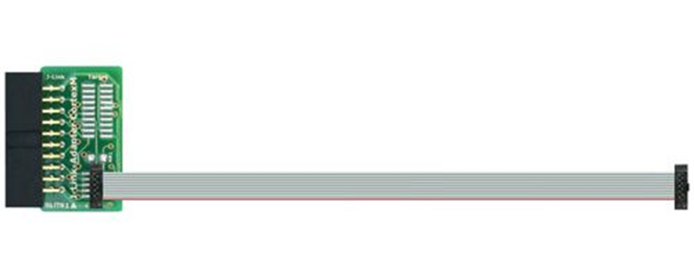   

## 3. Setup

This project contains all the source code for [NXP's Smart Voice UI solution](https://www.nxp.com/mcu-svui).\
For more information about getting up and running with the Smart Voice UI, check out the [Smart Voice UI Getting Started Guide](https://www.nxp.com/document/guide/getting-started-with-the-sln-svui-iot:GS-SLN-SVUI-IOT).

### 3.1 Step 1

Download MCUXpresso 11.10.0
- Go to this URL: [https://www.nxp.com/mcuxpresso/ide](https://www.nxp.com/mcuxpresso/ide)
- Click on "Downloads" orange button

- Go to the "MCUXpresso Integrated Development Environment (IDE)" section and click "Download"

- You might be asked to login to your NXP account if not already logged in

- After logging in you will see the product information. Click on "MCUXpresso IDE" link

- Agree with the "Software Terms and Conditions", then you will have access to the download links

### 3.2 Step 2

Download MIMXRT1060-EVKC v2.16.0 SDK

- Go to this URL: [https://mcuxpresso.nxp.com/](https://mcuxpresso.nxp.com/)
- Press on "Select Development Board"

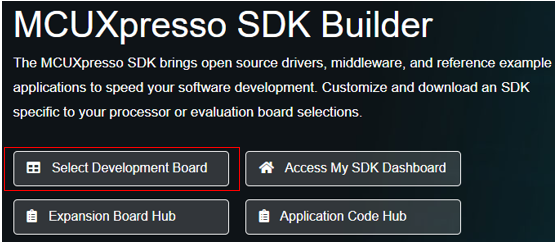   

- In "Search for Hardware" input RT1060 EVKC
- The "MIMXRT1060-EVKC" board should appear in the results

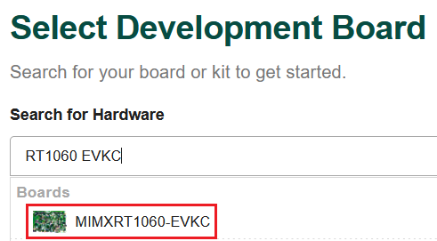   

- Click on the board
- In the right side of the screen you should have the "Build SDK" button
- SDK version should be 2.16.0 (if not selected by default)

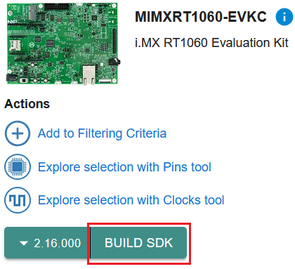   

- Select "MCUXpresso IDE" as Toolchain if not already selected
- Click on "Build SDK" button from the bottom of the page

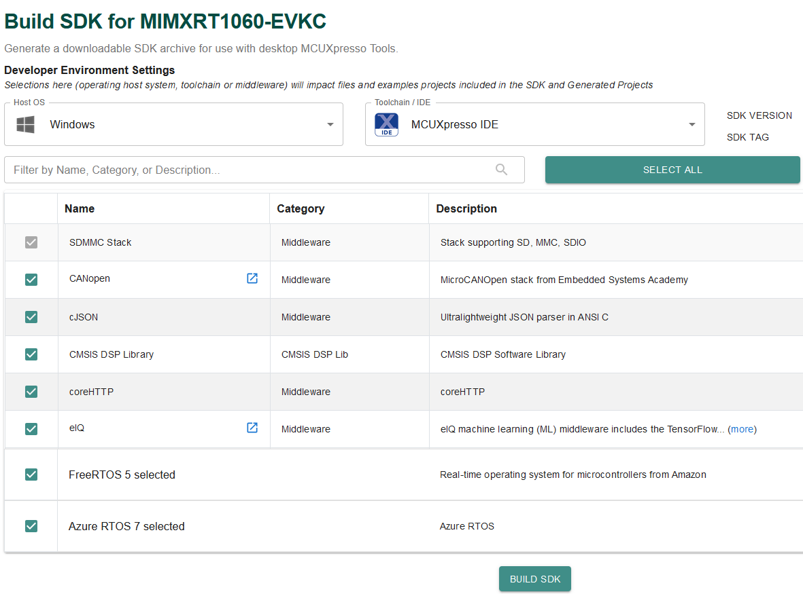   

- The SDK might appear as building for a while
- Once ready, it will be available for download in the MCUXpresso SDK Dashboard

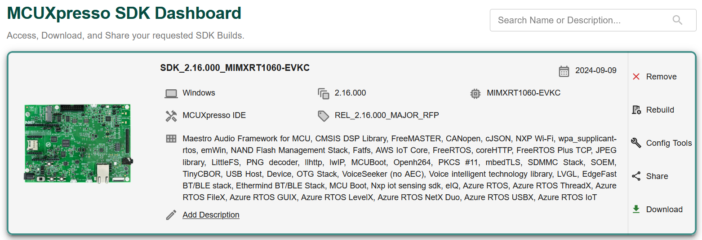   

### 3.3 Step 3

Install SDK in IDE

- Open MCUXpresso IDE
- If it is the first time when the tool is opened, "Welcome" page will be displayed. You may close it

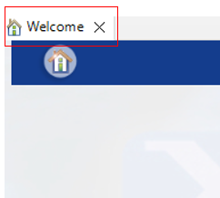   

- You should now be able to see the "Installed SDKs" view
- To install the previously downloaded SDK, drag and drop the zip into this IDE view
- Below is an example of how the view looks after the SDK is installed

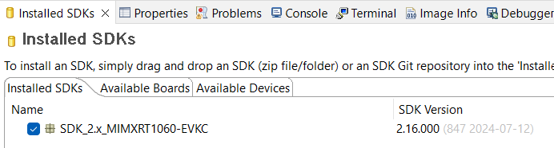   

- You will be asked to confirm the SDK installation, press on "OK"

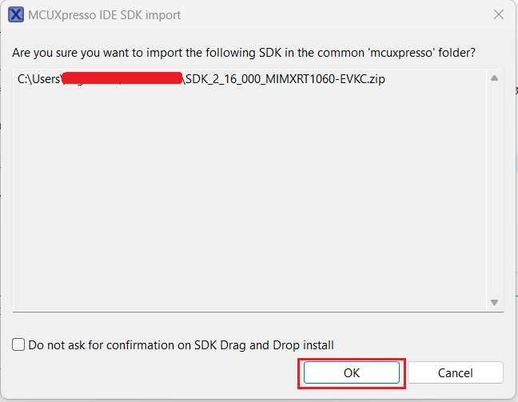   

### 3.4 Step 4 (Optional, only if DSMT is used)

Download Cyberon DSpotter Modeling Tool v2, version 2.2.19.1

- Go to this URL: [https://tool.cyberon.com.tw/DSMT_V2/index.php?lang=en](https://tool.cyberon.com.tw/DSMT_V2/index.php?lang=en)
- Scroll down until you reach "Download" section
- Click and download v2.2.19.1

### 3.5 Step 5

Download the Ivaldi tool

- Go to this URL: [https://www.nxp.com/mcu-svui](https://www.nxp.com/mcu-svui) and download the **tools** package.

Update to latest binaries using pre-configured Ivaldi

- Before starting the customization examples, we need to make sure that we have the right setup and the board is running the latest NXP software.

#### Using pre-configured Ivaldi

- The pre-configured Ivaldi is a ready-to-use tool specially designed to ease board updating process
- It can also be used as manufacturing tool
- It is available in **tools/Ivaldi_updater** folder
- After downloading the folder, the content for the pre-configured Ivaldi should look as in the image below:

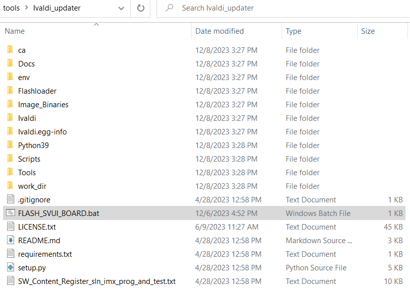   

- In the Image_Binaries folder you can find:
    - the applications' images (bootstrap, bootloader, local_demo_vit and local_demo_dsmt)
    - the audio files that will be programmed in flash
    - the binary containing the audio files (file_system) is automatically generated and added into the folder when running the script

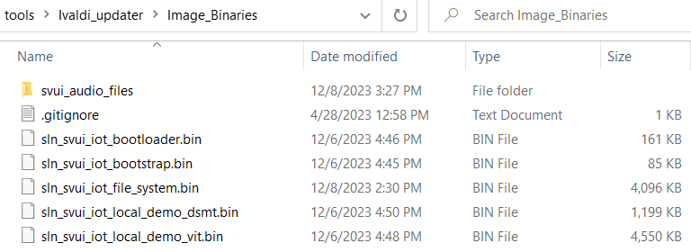   

> [!NOTE]
> Do not move the jumper when the board is powered on.

- After powering off the board, put the board in **serial downloader mode** by moving jumper **J61** to connect **pins 2 and 3** (towards the buttons)

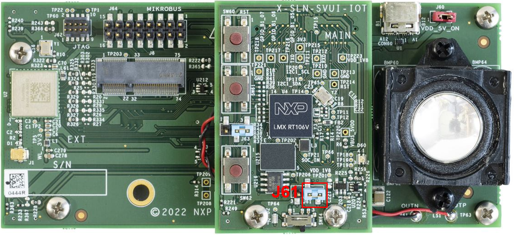   

- Plug the USB Type-C connector into the SLN-SVUI-IOT board and the USB type-A connector into your computer
- Start the FLASH_SVUI_BOARD.bat script selected above
- The output should look like this:

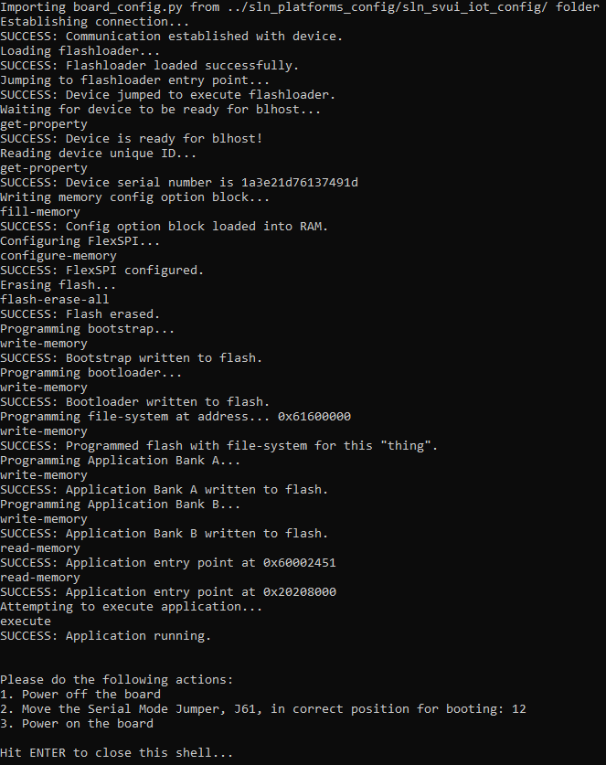   

- When the update is done, disconnect the board, move the jumper to the initial position (connecting pins 1 and 2 - towards the speaker) and reboot the board

### 3.6 Step 6 (Optional, only when you want to make an update using MSD)

MSD update

#### Generate binary from the axf

- Select and build the project.

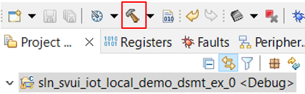   

- Right click on the generated .axf file
- Go to Binary Utilities -> Create binary

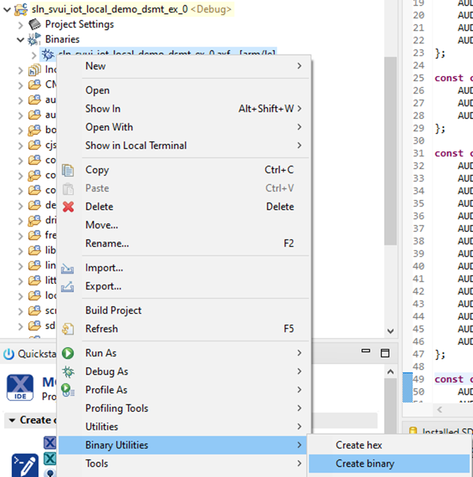   

- Right click on the same .axf file, then go to Utilities -> Open directory browser here

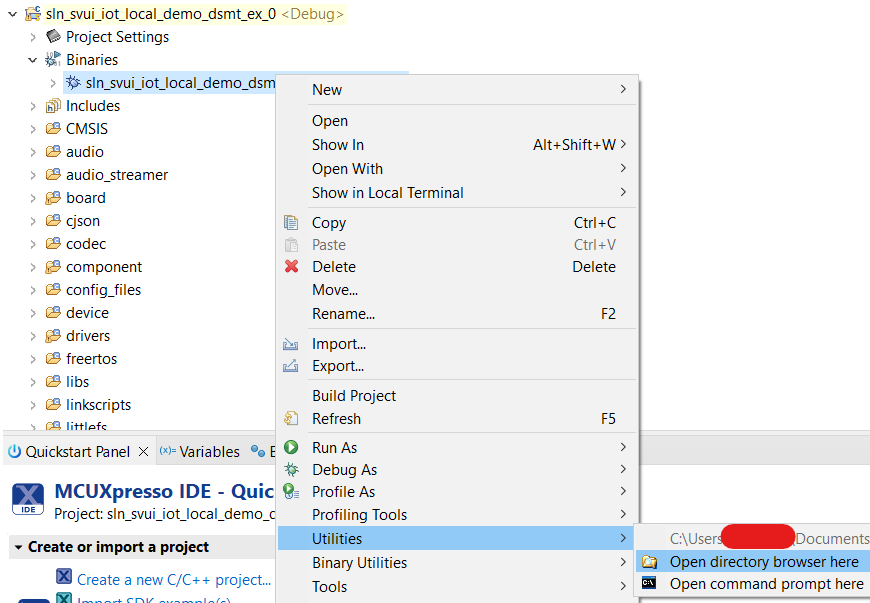   

- You can now use the generated .bin for MSD update

#### Enter MSD mode

- To put the device into MSD mode, hold down switch 2 (SW2) while board boots (remove the power, press SW2, re-insert the powering cable)
- LED should light pink, on and off at 3 seconds intervals
- Then a new drive should have been mounted
- Copy - paste or drag and drop the generated binary as you would do with a memory stick
- Blue LED will start to blink. When the process will end, green LED will blink once

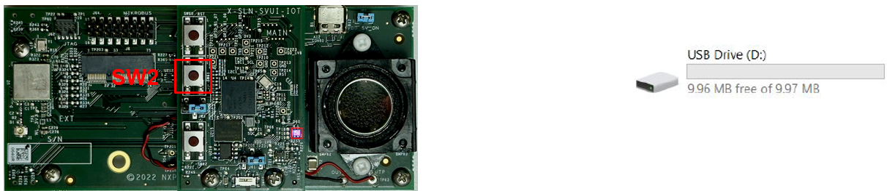   

### 3.7 Step 7

Serial terminal setup

- Serial terminal can be used to
    - Switch between demos
    - Select languages
    - See logs (for detection and other events)
- Tera Term (Windows Only)
    - [https://osdn.net/projects/ttssh2/releases/](https://osdn.net/projects/ttssh2/releases/)
- PuTTY
    - [https://putty.org/](https://putty.org/)
- Serial connection settings are the ones below (COM port will need to be adapted accordingly):

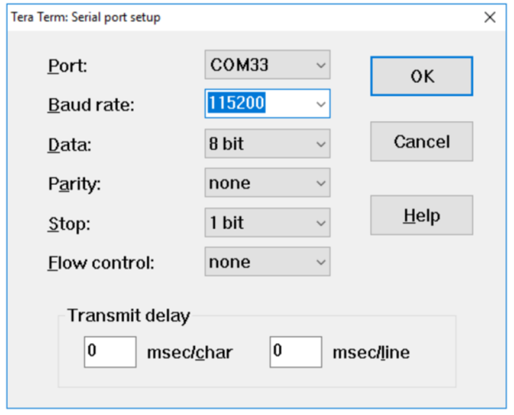   

### 3.8 Step 8

Download project libraries

All libraries used in the SVUI project can be found in a zip file under the name **sln_svui_iot_libs.zip** on the solution page on [nxp.com](https://www.nxp.com/mcu-svui). After downloading, unzip the libraries and add them to the desired project, sln_svui_iot_local_demo or sln_svui_iot_aec_demo, in the **libs** folder.

After adding the files, the content for the **sln_svui_iot_local_demo/libs** or **sln_svui_iot_aec_demo/libs** should look as in the image below:

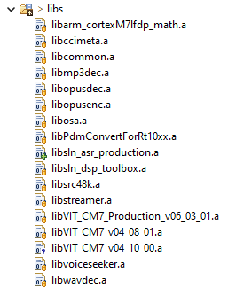   

### 3.9 Step 9

DSMT production and evaluation libraries

> [!NOTE]
> For DSMT integration, there are 2 libraries included: the production lib_sln_asr and the evaluation lib_sln_asr.
>
> The sln_asr_production lib is found in the **sln_svui_iot_libs.zip** file together with the rest of the libraries.
>
> The sln_asr_evaluation lib needs to be downloaded separately from the solution page on [nxp.com](https://www.nxp.com/mcu-svui).
>
> The production library works only on RT106C.
>
> The dev kit is based on RT106V.
>
> In order to have the DSMT project working on RT106V, one must use the evaluation lib_sln_asr.
>
> The lib must be used for evaluation only and not for going into production as this will break the redistribution terms.

In order to link with the production lib_sln_asr, one must:
1. Copy libsln_asr_production.a in sln_svui_iot_local_demo/libs folder.
2. Right click on the sln_svui_iot_local_demo MCUXpresso project, select Properties -> C/C++ Build -> Settings -> MCU Linker -> Libraries.
3. Add the sln_asr_production entry.
4. Build the DSMT project.

When using the libsln_asr_production.a, for going into production with RT106C, please do not forget to set USE_DSMT_EVALUATION_MODE to 0 in app.h.

In order to link with the evaluation lib_sln_asr, one must:
1. Copy libsln_asr_evaluation.a in sln_svui_iot_local_demo/libs folder.
2. Right click on the sln_svui_iot_local_demo MCUXpresso project, select Properties -> C/C++ Build -> Settings -> MCU Linker -> Libraries.
3. Add the sln_asr_evaluation entry.
4. Build the DSMT project -> now it should run successfully on the smart voice dev kit.

### 3.10 Step 10

VIT speech-to-intent and commands libraries

> [!NOTE]
> VIT offers two types of voice detection engines: one of them used for detecting only predefined commands and the other one 
> being able to detect intents thus offering a lot more flexibility.

The following VIT libraries are found in the **sln_svui_iot_libs.zip** file on the solution page [nxp.com](https://www.nxp.com/mcu-svui):
- VIT_CM7_Production_v06_03_01 for **sln_svui_iot_local_demo** with the speech-to-intent engine
- VIT_CM7_v04_08_01 for **sln_svui_iot_local_demo** with the VIT engine
- VIT_CM7_v04_10_00 for **sln_svui_iot_aec_demo**

> [!NOTE]
> The models from **sln_svui_iot_local_demo** project were originally created for the VIT_CM7_v04_08_01 lib version. This is the reason for which we use different libs in **sln_svui_iot_local_demo** and **sln_svui_iot_aec_demo** projects.

Depending on the desired demo and engine combination, the user needs to download the specific library from the solution page and then follow the steps below.

In order to link the speech-to-intent VIT library, one must:
1. Copy VIT_CM7_Production_v06_03_01.a in sln_svui_iot_local_demo/libs folder.
2. Right click on the project you want to use the speech-to-intent VIT library for, meaning the **sln_svui_iot_local_demo** MCUXpresso project, select Properties -> C/C++ Build -> Settings -> MCU Linker -> Libraries.
3. If there is already an entry for the other VIT libraries, replace it with the VIT_CM7_Production_v06_03_01. Otherwise, simply add the VIT_CM7_Production_v06_03_01 entry.
4. Select S2I ASR in app.h and build the project.

In order to link the commands VIT library, one must:
1. Copy VIT_CM7_v04_08_01.a for **sln_svui_iot_local_demo** or VIT_CM7_v04_10_00.a for **sln_svui_iot_aec_demo** in sln_svui_iot_local_demo/libs folder.
2. Right click on the project you want to use the commands VIT library for, either the **sln_svui_iot_local_demo** or the **sln_svui_iot_aec_demo** MCUXpresso project, select Properties -> C/C++ Build -> Settings -> MCU Linker -> Libraries.
3. If there is already an entry for the other VIT libraries, replace it with VIT_CM7_v04_08_01 for **sln_svui_iot_local_demo** or with VIT_CM7_v04_10_00 for **sln_svui_iot_aec_demo**. Otherwise, simply add the corresponding entry for each demo.
4. Select VIT ASR in app.h and build the project.

> [!NOTE]
> We encourage you to always use the latest VIT lib when generating new models.

### 3.11 Step 11 (Optional, only when you want to use Visual Studio Code)

Importing, building and debugging the Smart Voice projects using Visual Studio Code

Prerequisites for VS Code + MCUXpresso extension:
1. Download and install VS Code from [the official website](https://code.visualstudio.com/)
2. Install the dependencies for the MCUXpresso extension by following the guide [here](https://github.com/nxp-mcuxpresso/vscode-for-mcux/wiki/Dependency-Installation).
3. Download and install the MCUXpresso extension from [the web marketplace](https://marketplace.visualstudio.com/publishers/NXPSemiconductors) or through the VS Code built-in marketplace.

Having made the setup, you can now import, build and debug the sln_svui_iot_local_demo project (or any other example) directly in VS Code:
1. Import the sln_svui_iot_local_demo project.
2. You will be asked to select a workspace folder. The extension works by copying the projects into the workspace.
3. Select the desired toolchain.

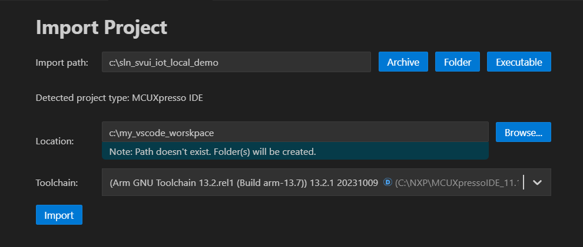   

4. Add the libs folder into the project found in the workspace (the copy).
5. Select your desired build configuration.

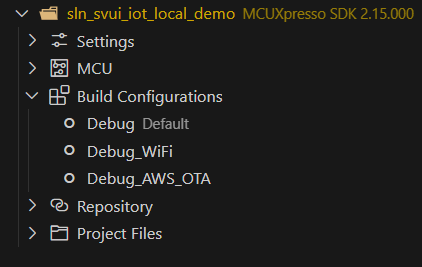   

6. Build the project.

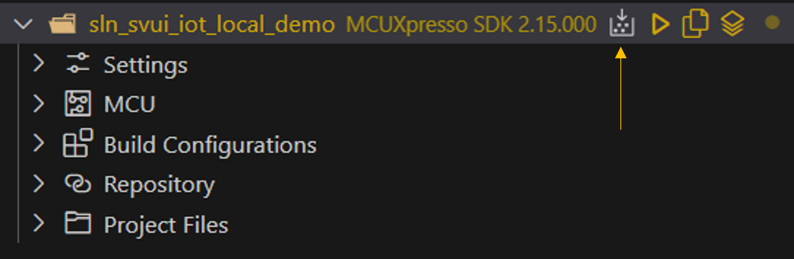   

7. Debug the project. The first time you debug, J-Link will ask for the device type, select MIMXRT1062XXX6B.

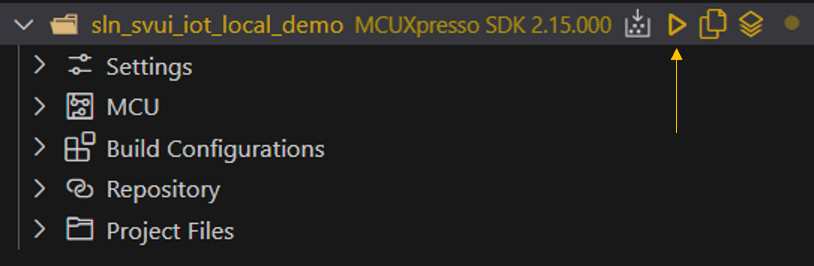   

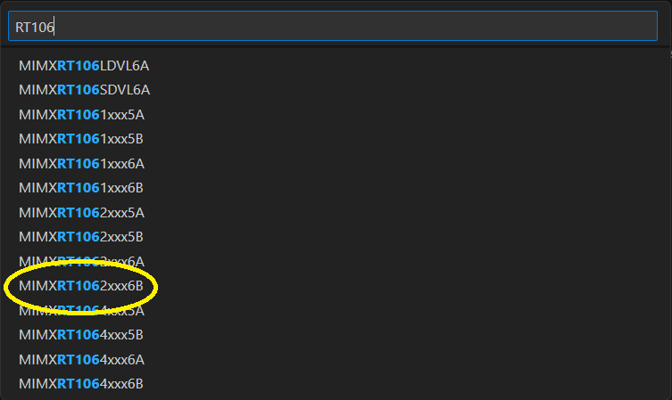   

8. Navigate the project using the VS Code debugger tab.

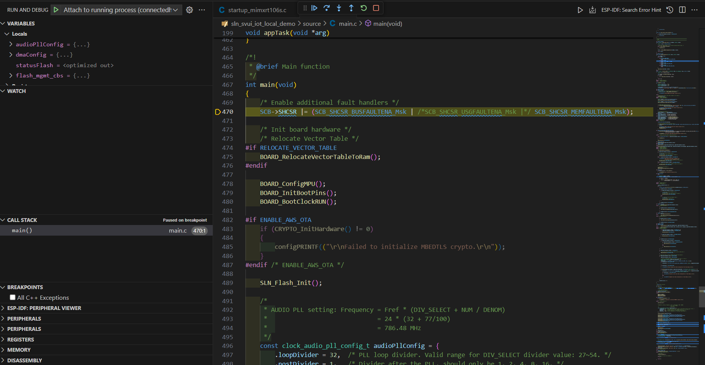   

## 4. Results

This section contains examples for different VIT and DSMT implementations.

### S2I

- [Example 0 - Add a new S2I EN model](examples/S2I/example_0/README.md)

### VIT

- [Example 0 - Add a new command in the existing English demo](examples/VIT/example_0/README.md)
- [Example 1 - Add a new EN model](examples/VIT/example_1/README.md)
- [Example 2 - Modify App Layer API to control LED after command detection](examples/VIT/example_2/README.md)
- [Example 3 - Test and tune a VIT model](examples/VIT/example_3/README.md)
- [Example 4 - Add new audio prompts](examples/VIT/example_4/README.md)
- [Example 5 - Add a new ES model](examples/VIT/example_5/README.md)
- [Example 6 - Play .WAV prompts from the binary](examples/VIT/example_6/README.md)
- [Example 7 - Play .WAV prompts from the file system](examples/VIT/example_7/README.md)

### DSMT

- [Example 0 - Add a new command in the existing English demo](examples/DSMT/example_0/README.md)
- [Example 1 - Add a new EN model](examples/DSMT/example_1/README.md)
- [Example 2 - Add a new ES model](examples/DSMT/example_2/README.md)
- [Example 3 - Test and tune a DSMT model](examples/DSMT/example_3/README.md)

### GPIO
- [Example 0 - Connect an external LED with GPIO](examples/GPIO/example_0/README.md)
- [Example 1 - Connect an external motor with PWM](examples/GPIO/example_1/README.md)

## 5. FAQs

### 5.1 What is the CPU usage for SVUI?

- NXP Speech-to-intent, 3 x I2S mics

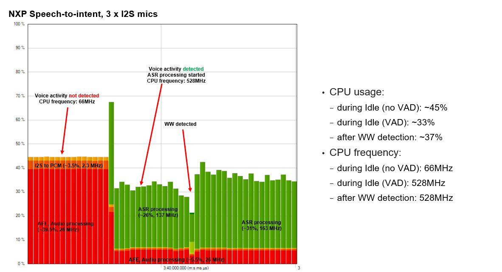   

- NXP VIT, 3 x 12S mics

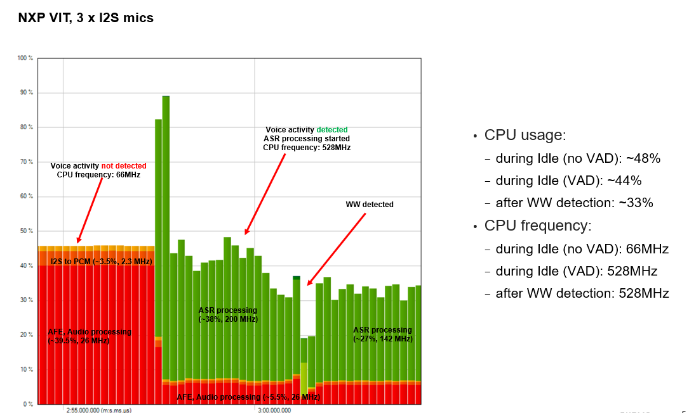   

- Cyberon DSMT Level 1 models, 3 x I2S mics

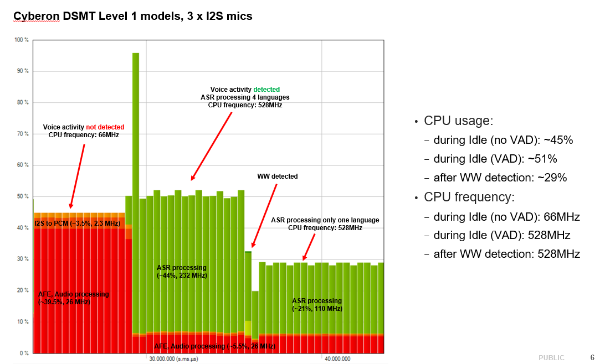   

- NXP Speech-to-intent, 2 x PDM mics

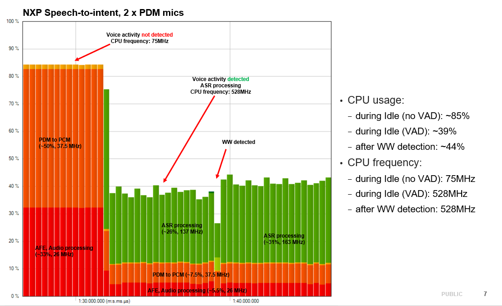   

- NXP Speech-to-intent + AEC, 2 x I2S mics

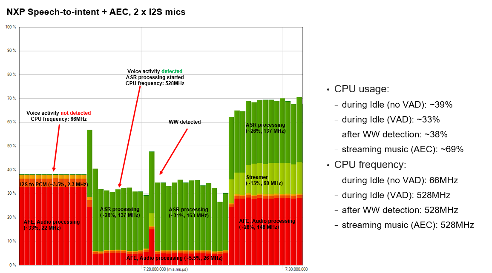   

- NXP VIT + AEC, 2 x I2S mics

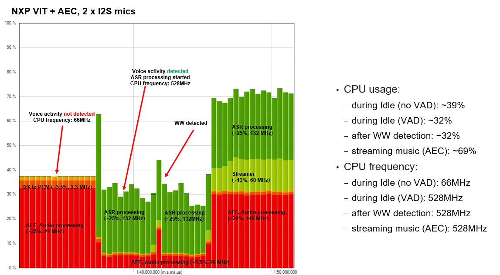   

- Cyberon DSMT Level 4 model + AEC, 2 x I2S mics

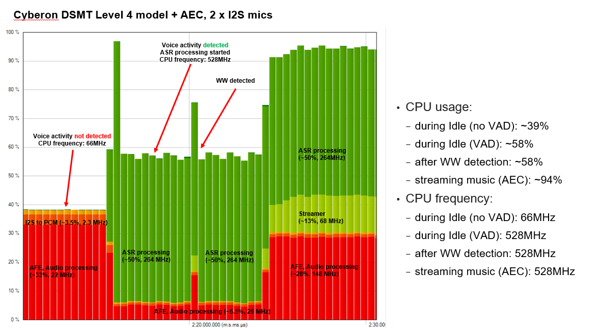   

### 5.2 What is the memory usage for SVUI?

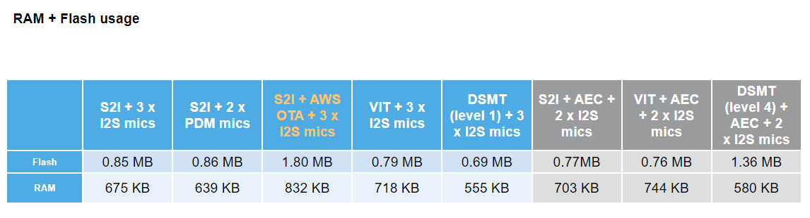   

### 5.3 What is the CPU usage for SVUI S2I + Matter?

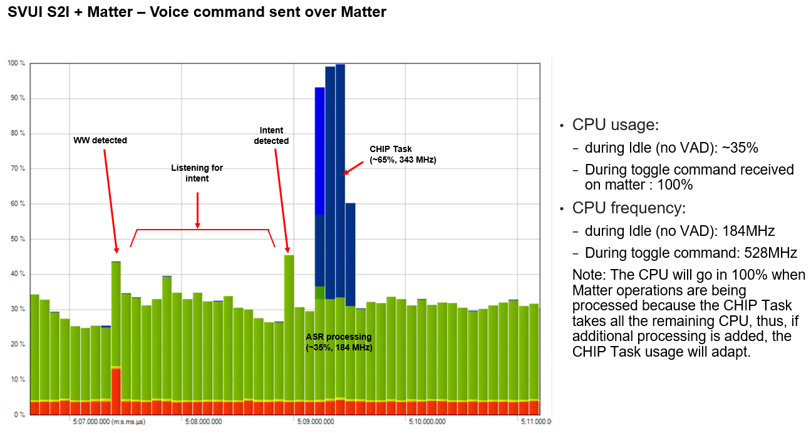   

### 5.4 What is the memory usage for SVUI + Matter?

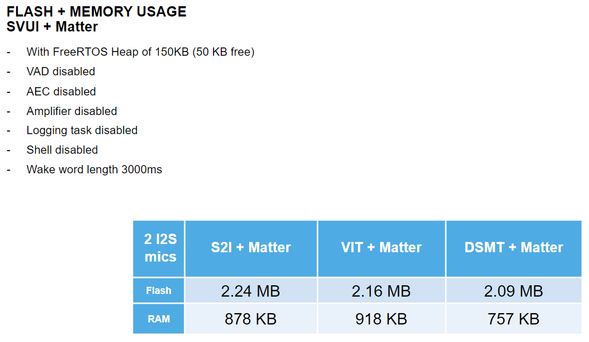   

### 5.5 What is the power consumption for SVUI?

Regarding power consumption of our Smart Voice solution:
1. We leverage Voice Seeker's VAD feature to go to a lower power state after a period of inactivity. In our latest code base we go to low power after 10 seconds of inactivity.
2. During low power we bypass ASR processing.
3. We switch from 528MHz to 66MHz for I2S implementation and to 75MHz for PDM implementation (we need more MIPS for PDM case since the decimation is done in software).
4. We backup latest 450ms of audio and after going to normal running mode we process those first.

With these optimizations we have the following (for the entire board, not for MCU only):
- 320mW for normal running mode
- 160mW for low power mode

The SOC (RT106V) power usage is the same as for a regular RT1062. Based on AN12245:

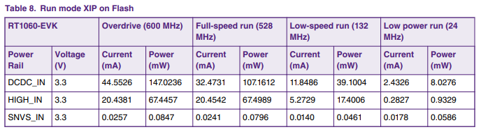   

At 528MHz, minimum power usage at 25 degrees Celsius would be 174mW.
The estimated minimum power usage at 75MHz is 30-40mW.

### 5.6 What are the recognition results for SVUI?

With NXP VIT S2I:
Wake word recognition: > 99% of wake words understood under silence, external kitchen noise and external music noise tests.
Expressions recognition: > 98% of expressions recognized in silence and external kithen noise. > 84% of expressions recognized for external music noise tests.
False triggers: 5 in 24 hours of English news playback.

With NXP VIT:
Wake word recognition: 97% of wake words understood under silence, 96,5% under external kitchen noise and 96% under external music noise tests.
Commands recognition: 96.5% of commands recognized in silence, 96% under external kitchen noise and 89% under external music noise tests.
False triggers: 6 in 24 hours of English news playback, 6 in 24 hours of German news playback, 1 in 24 hours of French news playback, 6 in 24 hours of Chinese news playback.

## 6. Support

If you have any questions or feedback on this code please contact NXP support or post on our community at https://community.nxp.com/.

#### Project Metadata

<!----- Boards ----->

<!----- Categories ----->

<!----- Peripherals ----->

<!----- Toolchains ----->

Questions regarding the content/correctness of this example can be entered as Issues within this GitHub repository.

>**Warning**: For more general technical questions regarding NXP Microcontrollers and the difference in expected functionality, enter your questions on the [NXP Community Forum](https://community.nxp.com/)

## 7. Release Notes
| Version | Description / Update                           | Date                        |
|:-------:|------------------------------------------------|----------------------------:|
| 1.0     | Initial release on Application Code Hub        | October 30th 2024 |

## 8. Known issues
| ID      | Description                                    | Additional details      |
|:-------:|------------------------------------------------|----------------------------:|
| 1 | Copy paste doesn't work properly on UART shell | Some characters will be missed when pasting |
| 2 | Very rarely, SVUI board disconnects from Matter network  | After reset it is functional again |
| 3 | ERROR: USB_DeviceCdcAcmSend failed 2 during USB audio dump  | If the system where the dump is captured is very slow, some frames might be lost |
| 4 | WiFi audio dump "Failed to push frames to audio dump queue"  | If the network bandwidth is not enough, some frames might be lost |
| 5 | Ivaldi doesn't work on Mac OS                  | Little FS module version used by ivaldi doesn't support Mac OS |
| 6 | After a reset, it might be needed to issue a command multiple times to a device | Recreating the binding table needs some time |
