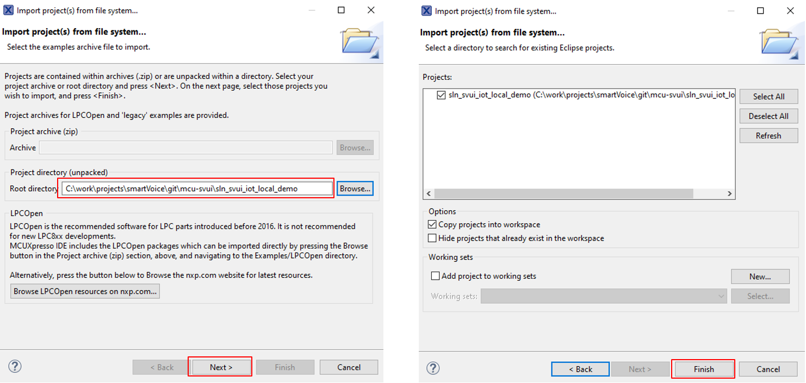

# Example 0 - Add a new command in the existing English demo

The purpose of this example is to add a new command at the end of the current supported commands for English Elevator demo: "Shut door".

For this command we will reuse the same action and prompt as we have for "Close door" command.

The patch ex0_dsmt.patch [can be applied](../../../README.md#applying-patches) to obtain the end-result of this example.

## Import the project

- Make sure you have the correct version of SDK (2.16.0). In case you don't, please follow the instructions from the main README on [how to download and install it](../../../README.md#download-mimxrt1060-evkc-v2.16.0-sdk)

- With MCUXpresso IDE open, then click on "Quickstart Panel" -> "Import projects from file system"


- Browse to where the repo was cloned and select  `sln_svui_iot_local_demo` folder
- Press "Next", then leave the default options selected and press on "Finish"



- For avoiding conflicts with next examples, rename the project to **sln_svui_iot_local_demo_dsmt_ex_0** (either Right click on project -> Rename or press F2 and rename window will open)

## Open the DSMT project

- Open the project from local_voice -> DSMT -> en folder (double click on it)


- Cyberon login page will open
- If you have an account already created, use those credentials


- If you do not have an account, email local-commands@nxp.com with the following information:
    - Name
    - Email
    - Company
    - Physical address (MAC)

## DSMT tool introduction

- **Energy Threshold**: Energy Threshold that sets the minimal energy for a recognized command is a global setting applied to the entire model, hopefully to reject some falsely recognized commands caused by the background noise of relatively low volume, this parameter is RMS value, recommended range:0~200.
- **Confidence Reward(group)**: Confidence Reward(group) applies to all commands in the entire model. Decreasing the Confidence Reward(group) will inhibit the false alarms. But its side effect is to make the recognizer less responsive to users' commands, recommended range:-10~10, Engine will add group and command confidence reward as confidence score offset.
- **SG Difference Reward**:  SG Difference Reward applies to all commands in the entire model. Decreasing the SG Difference Reward will inhibit the false alarms. But its side effect is to make the recognizer less responsive to users' commands, recommended range:-10~10.
- **Ending Silence**: Ending Silence applies to the entire model. It defines the duration of silence in seconds after the voice input for the engine to determine the end of a voice command.
- When user click \"Reset\", Cyberon DSMT Tool will set the 4 setting-values in the global block of this group to default value.


Visit the following for more information:
- [Cyberon DSMT Tool V2](http://tool.cyberon.com.tw/DSMT_V2/index.php?lang=en)
- [Cyberon Youtube channel](https://www.youtube.com/watch?v=RZ308xVS3Cc&list=PLTEknqO5GAbrDX5NMs-P6b9THWwamgVBo&index=1&ab_channel=cyberon)

## Adding a new command in English Elevator DSMT Group

We will add a new command for the elevator demo, so click on `CMD_ELEVATOR` group.

- Type "Shut door" in "Input Command", then press on "Add" button
- A new command will be added at the end of "Command List"


- It will be needed to have the same CmdMapID for all commands, so we must update this latest addition: double click on the new command (or press edit button) and "Edit command" window will open. Update CmdMapID to 3, then press "OK"


- In order to update the voice model binary, we need to save the DSMT project (CTRL + S or File -> Save project)

## Integrating the model in sln_svui_iot_local_demo

1. Update **_source/app.h_**:
    - Set `ENABLE_DSMT_ASR` to `1`
    - Set `ENABLE_VIT_ASR` to `0`
    - Set `ENABLE_S2I_ASR` to `0`
    ```c
    /* Choose the ASR engine, DSMT, VIT or S2I */
    #define ENABLE_DSMT_ASR                1
    #define ENABLE_VIT_ASR                 0
    #define ENABLE_S2I_ASR                 0
    ```

2. Update **_local_voice_DSMT/en/en_strings_dsmt.h_**:
    - This file contains strings associated with the commands from the model
    - Please note that there must be a string entry for every command entry from the DSMTv2
    ```c
    const char * const cmd_elevator_en[] = {
        "First floor",
        "Second floor",
        "Second floor ^1",
        "Third floor",
        "Fourth floor",
        "Fifth floor",
        "Fifth floor ^1",
        "Main lobby",
        "Ground floor",
        "Basement floor",
        "Open door",
        "Close door",
        "Close door ^1",
        "Change demo",
        "Shut door",
    };
    ```

3. Update **_local_voice_DSMT/en/en_strings_to_actions_dsmt.h_**:
    - This is basically an association between DSMTv2 commands entries and actions from demo_actions_dsmt.h
    - We could have one action for synonym commands
    - We'll reuse CloseDoor action for the new command
    ```c
    const int16_t actions_elevator_en[] = {
        kElevator_FirstFloor,    // "First floor"
        kElevator_SecondFloor,   // "Second floor"
        kElevator_SecondFloor,   // "Second floor ^1"
        kElevator_ThirdFloor,    // "Third floor"
        kElevator_FourthFloor,   // "Fourth floor"
        kElevator_FifthFloor,    // "Fifth floor"
        kElevator_FifthFloor,    // "Fifth floor ^1"
        kElevator_MainLobby,     // "Main lobby"
        kElevator_GroundFloor,   // "Ground floor"
        kElevator_BasementFloor, // "Basement floor"
        kElevator_OpenDoor,      // "Open door"
        kElevator_CloseDoor,     // "Close door"
        kElevator_CloseDoor,     // "Close door ^1"
        kElevator_ChangeDemo,    // "Change demo"
        kElevator_CloseDoor      // "Shut door"
    };
    ```

4. Update **_local_voice_DSMT/en/en_strings_to_prompts_dsmt.h_**:
    - If no prompts are required, entries can be set to NULL
    - In this integration, we are reusing the CLOSE_DOOR prompt when the new command is detected
    - Integrating new prompts will be shown in a separate section
    - You can now compile and flash the new project
    ```c
    const void * const prompts_elevator_en[] = {
        AUDIO_FIRST_FLOOR_EN,    // "First floor"
        AUDIO_SECOND_FLOOR_EN,   // "Second floor"
        AUDIO_SECOND_FLOOR_EN,   // "Second floor ^1"
        AUDIO_THIRD_FLOOR_EN,    // "Third floor"
        AUDIO_FOURTH_FLOOR_EN,   // "Fourth floor"
        AUDIO_FIFTH_FLOOR_EN,    // "Fifth floor"
        AUDIO_FIFTH_FLOOR_EN,    // "Fifth floor ^1"
        AUDIO_MAIN_LOBBY_EN,     // "Main lobby"
        AUDIO_GROUND_FLOOR_EN,   // "Ground floor"
        AUDIO_BASEMENT_FLOOR_EN, // "Basement floor"
        AUDIO_OPEN_DOOR_EN,      // "Open door"
        AUDIO_CLOSE_DOOR_EN,     // "Close door"
        AUDIO_CLOSE_DOOR_EN,     // "Close door ^1"
        AUDIO_DEMO_NAME_TEST_EN, // "Change demo"
        AUDIO_CLOSE_DOOR_EN,     // "Shut door"
    };
    ```

## Updating app version

It is always a good idea to update application version when planning to update via [MSD](../../../README.md#msd-update) because it will be an easy way to check if the binary got updated, by calling command `version` in the shell.

The binary version definitions are found in **_source/app.h_**.
```c
/* Application version */
#define APP_MAJ_VER                    0x02
#define APP_MIN_VER                    0x00
#define APP_BLD_VER                    0x0001
```

## Test the new project

- In the shell, type `version` and check that the output is the expected one
- Type `commands` and check that what was added new to this demo is there in the output
- Say the wake word (Hey, NXP), then the newly added command, and check if the detection happens

 <br> </br>

