# Example 1 - Add a new EN model

In this example we will remove all existing DSMT models, for all languages, and we will add a new DSMT English model.

The patch ex1_dsmt.patch [can be applied](../../../README.md#applying-patches) to obtain the end-result of this example.

## Import a new instance of the project

- Make sure you have the correct version of SDK (2.16.0). In case you don't, please follow the instructions from the main README on [how to download and install it](../../../README.md#download-mimxrt1060-evkc-v2.16.0-sdk)

- Open MCUXpresso IDE, then click on "Quickstart Panel" -> "Import projects from file system"


- Browse to where the repo was cloned and select `sln_svui_iot_local_demo` folder
- Press "Next", then leave the default options selected and press on "Finish"


- For avoiding conflicts with next examples, rename the project to **sln_svui_iot_local_demo_dsmt_ex_1** (either Right click on project -> Rename or press F2 and rename window will open)

## Creating a new DSMTv2 project

- Open "Cyberon DSpotter Modeling Tool V2"
- Cyberon login page will open
- If you have an account already created, use those credentials

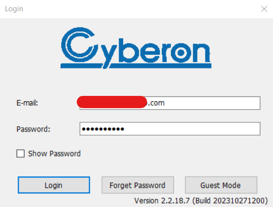

- If you do not have an account, email local-commands@nxp.com with the following information:
    - Name
    - Email
    - Company
    - Physical address (MAC)
- Go to File -> New Project

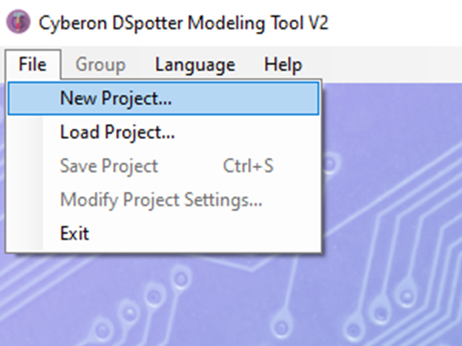

- Add a name for your project and select the language from the "Language" drop-down list.
- Press OK

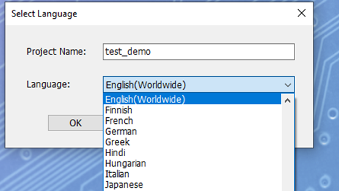

- Then confirm project settings

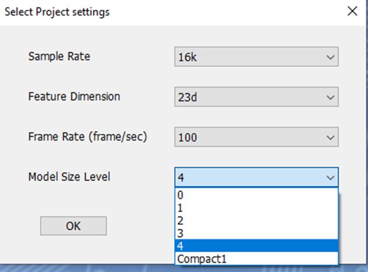

- The only thing that can be modified currently is the Model Size Level:
    - The bigger the model, the better the detection, especially in noisy conditions
    - CPU and RAM usage will increase, but we support even the biggest model size (4) with our solution. We recommend the biggest model for the best performance

- You will then be asked to select a folder in which the project will be saved
- For ease of use, it is simpler to save the .dsmt project in the language folder of the MCUXpresso project because the voice model binary is created in the same folder as the .dsmt file
- So when you modify the model, you will just save it (Ctrl + S or File -> Save project) and the resulted binary will be updated in the same folder from where it is used by the MCUXpresso project, i.e. you will not need to copy - paste the model from a different location

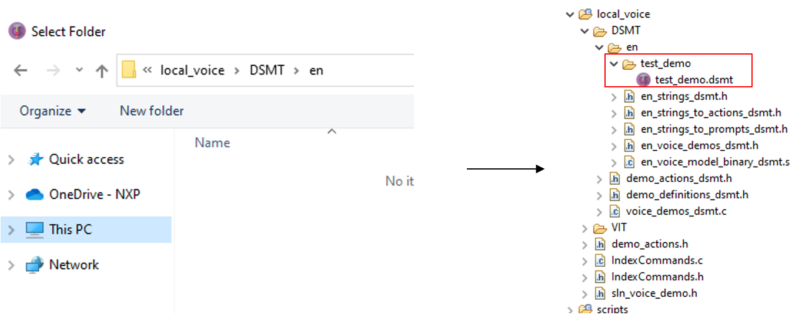

## Creating a new DSMTv2 project - Adding wake words

Group_1 should be used for wake words.
- Groups can optionally be renamed from "Group -> Rename" for a clearer identification of the groups
- Commands can be added by pressing ENTER key after writing text in the "Input Command" text box or by clicking "Add" button:
    - For this example, we will initially add an entry for "Hey NXP"
- Commands indexes can be changed by moving them with "Up" and "Down" buttons.
- All wake words must be edited to have CmdMapId value set to 1 instead of the default -1
    - This can be done either by double clicking on the inserted command or by clicking on it, then on the edit button

> [!NOTE]
> If the text for the command is modified in the "Edit command" window, this will not modify the phonemes! (it is easier to re-add a command if needing to change it, than to edit it, because it will be needed to edit the phonemes as well).

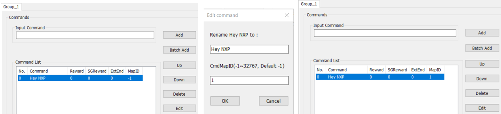

## Creating a new DSMTv2 project - Adding commands

- First it is needed to add a new Group from the menu: Group -> Insert
- CmdMapID will need to be changed to the group index value, in our case 2
- If we would insert an additional group of commands, we would need to use CmdMapID value 3 for it
- For this example we will add the following commands: Mute, Next, Skip, Pause, Stop

What can be observed is that for some commands the tool will automatically add multiple versions with slightly different phonemes.

That is because some words are pronounced slightly different in different regions. You can check the difference between them by clicking on each one and seeing how they differ in the "Command Phoneme" field.

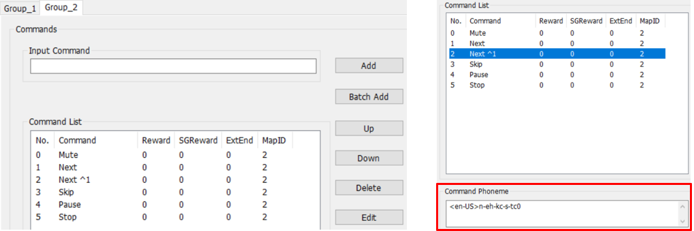

## Generating the voice model binary

- Check the MapID box. It generates test_demo_pack_WithMapID.bin, which is what we will use for integration in the firmware

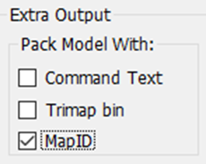

- Save the project (Ctrl + S or File -> Save project)
- The test_demo folder should look as shown below

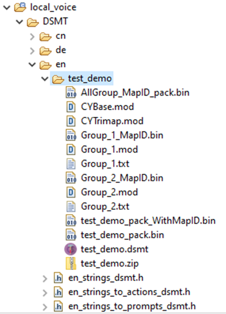

## Integrating the model in sln_svui_iot_local_demo

1. To clean up the **_local_voice/DSMT_** folder, delete folders for other languages: cn, de, fr, hi, nl, th, vn.\
    Previous model binary and .dsmt file can be deleted

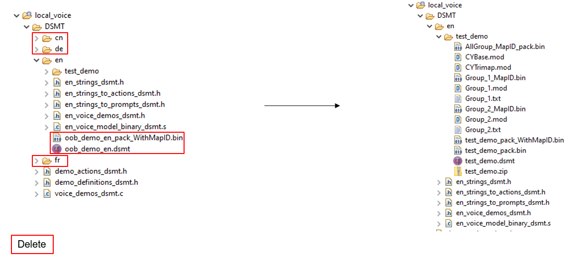

2. Update **_source/app.h_**:
    - Set `ENABLE_DSMT_ASR` to `1`
    - Set `ENABLE_VIT_ASR` to `0`
    - Set `ENABLE_S2I_ASR` to `0`
    - Set `ENABLE_NXP_OOBE` to `0`
    ```c
    /* Choose the ASR engine, DSMT or VIT */
    #define ENABLE_DSMT_ASR 1
    #define ENABLE_VIT_ASR 0
    #define ENABLE_S2I_ASR 0
    ```
    ```c
    /* Enable NXP out of the box experience. If set to 0,
    * no demo change or language change available through voice commands,
    * but these actions will still be possible through shell commands. */
    #define ENABLE_NXP_OOBE 0
    ```

3. Update **_local_voice/DSMT/demo_definitions_dsmt.h_**:
    - Update `asr_language_t` so that we have an entry only for English language.
    ```c
    /* Enumeration of the languages supported by the project
    * Add, remove or replace languages here, but keep the one bit
    * per language allocation, as currently implemented.
    * The code assumes one bit allocation per definition */
    typedef enum _asr_languages
    {
        UNDEFINED_LANGUAGE = 0,
        ASR_FIRST_LANGUAGE = (1U << 0U),
        ASR_ENGLISH = (1U << 0U),
        ASR_ALL_LANG = (ASR_ENGLISH)
    } asr_language_t;
    ```

    - Add a demo entry in `asr_inference_t`. The previous entries for OOBE demos can all be removed.
    ```c
    /* Enumeration of the command sets integrated into the project
    * Add, remove or replace the command sets here.
    * This must match the order from the DSMT project.
    * Keep the one bit per command set allocation, as currently implemented.
    * The code assumes one bit allocation per definition */
    typedef enum _asr_inference
    {
        UNDEFINED_INFERENCE = 0,
        ASR_WW = (1U << 0U),
        ASR_CMD_TEST_DEMO = (1U << 1U),
    } asr_inference_t;
    ```

    - Update `NUM_CMD_GROUPS`, `NUM_LANGUAGES`, `MULTILINGUAL`.
    ```c
    /* number of command groups, besides wake word group
    * in our oobe implementation: change_demo, elevator, washing machine, smart home */
    #define NUM_CMD_GROUPS (1)

    /* languages supported in the firmware (not necessarily running at the same time)
    * this number can be increased depending on the project needs */
    #define NUM_LANGUAGES (1)

    /* listen for multiple wake words in parallel */
    #define MULTILINGUAL (0)
    ```

    - Set `BOOT_ASR_CMD_DEMO` and `DEFAULT_ASR_CMD_DEMO` to `ASR_CMD_TEST_DEMO`.
    ```c
    /* demo after first boot. can be used for selecting the demo at the very first board boot */
    #define BOOT_ASR_CMD_DEMO ASR_CMD_TEST_DEMO

    /* default demo. this can have the same value as BOOT_ASR_CMD_DEMO
    * in our POC we use BOOT_ASR_CMD_DEMO to give the possibility to the user to select the demo
    * via voice commands. If a selection is not made until the timeout is hit, then
    * DEFAULT_ASR_CMD_DEMO will be loaded */
    #define DEFAULT_ASR_CMD_DEMO ASR_CMD_TEST_DEMO
    ```

    - Update the shell printing-related strings.
    ```c
    /* Strings used for shell printing or shell commands */
    #define LANG_STR_EN "en"

    #define DEMO_STR_TEST_DEMO "test"

    #define SHELL_SELECTABLE_DEMOS DEMO_STR_TEST_DEMO
    #define SHELL_SELECTABLE_LANGUAGES LANG_STR_EN
    ```

4. Update **_local_voice/DSMT/demo_actions_dsmt.h_** with actions for the new demo:
    - For a cleaner integration, all enums describing current OOBE demos were removed, and only the two enums shown below are needed
    - The purpose of this structure is to list all actions that the system should make
    - Later on, an action can be associated with one or with multiple voice commands
    ```c
    #if ENABLE_DSMT_ASR

    /* Global actions for all languages */

    enum _wake_word_action
    {
        kWakeWord_Detected = 0,
        kWakeWord_ActionInvalid
    };

    enum _test_demo_action
    {
        kTestDemo_Mute = 0,
        kTestDemo_Next,
        kTestDemo_Skip,
        kTestDemo_Pause,
        kTestDemo_Stop,
        kTestDemo_ActionInvalid
    };

    #endif /* ENABLE_DSMT_ASR */
    ```

5. Update **_local_voice/DSMT/en/en_strings_dsmt.h_**:
    - This file contains strings associated with the commands from the model
    - All strings for the current OOBE demo can be deleted
    - Please note that there must be a string entry for every command entry from the DSMTv2
    - Moreover, there is an array of strings per DSMTv2 group
    ```c
    #if ENABLE_DSMT_ASR

    /* English demos strings below.
    * These must match the DSMTv2 groups */

    const char * const ww_en[] = {
        "Hey NXP"
    };

    const char * const cmd_test_demo_en[] = {
        "Mute",
        "Next",
        "Next ^1",
        "Skip",
        "Pause",
        "Stop",
    };

    #endif /* ENABLE_DSMT_ASR */
    ```

6. Update **_local_voice/DSMT/en/en_strings_to_actions_dsmt.h_**:
    - All actions for the current OOBE demo can be deleted
    - This is basically an association between DSMTv2 commands entries and actions from demo_actions_dsmt.h
    - We could have one action for synonym commands, like "Mute" or "Set volume to zero"
    ```c
    #if ENABLE_DSMT_ASR

    #include "demo_actions_dsmt.h"
    #include "stdint.h"

    const int16_t actions_ww_en[] = {
        kWakeWord_Detected, // "Hey NXP"
    };

    const int16_t actions_test_demo_en[] = {
        kTestDemo_Mute,  // "Mute“
        kTestDemo_Next,  // "Next"
        kTestDemo_Next,  // "Next ^1"
        kTestDemo_Skip,  // "Skip"
        kTestDemo_Pause, // "Pause"
        kTestDemo_Stop,  // "Stop"
    };

    #endif /* ENABLE_DSMT_ASR */
    ```

7. Update **_local_voice/DSMT/en/en_strings_to_prompts_dsmt.h_**:
    - If no prompts are required, entries can be set to NULL
    - In this integration, we are reusing the OK prompt when one of the new commands is detected
    - Integrating new prompts will be shown in a separate section
    ```c
    #if ENABLE_DSMT_ASR

    #include "sln_flash_files.h"

    const void * const prompts_ww_en[] = {
        AUDIO_WW_DETECTED, // "Hey NXP"
    };

    const void * const prompts_test_demo_en[] = {
        AUDIO_OK_EN, // "Mute"
        AUDIO_OK_EN, // "Next"
        AUDIO_OK_EN, // "Next ^1"
        AUDIO_OK_EN, // "Skip"
        AUDIO_OK_EN, // "Pause"
        AUDIO_OK_EN, // "Stop"
    };

    #endif /* ENABLE_DSMT_ASR */
    ```

8. Update **_local_voice/DSMT/en/en_voice_demos_dsmt.h_**:
    - This file is used to define demo structure
    - All previous demo definitions can be deleted
    ```c
    #if ENABLE_DSMT_ASR

    #include "sln_voice_demo.h"
    #include "en_strings_dsmt.h"
    #include "en_strings_to_actions_dsmt.h"
    #include "en_strings_to_prompts_dsmt.h"
    #include "stddef.h"

    extern unsigned int en_model_begin;

    const sln_voice_demo_t demo_test_demo_en =
    {
        ww_en,                          // wake word strings
        cmd_test_demo_en,               // command strings
        actions_ww_en,                  // wake word actions
        actions_test_demo_en,           // command actions
        prompts_ww_en,                  // wake word prompts
        prompts_test_demo_en,           // command prompts
        NULL,                           // prompt for demo announcement
        NUM_ELEMENTS(ww_en),            // number of wake words
        NUM_ELEMENTS(cmd_test_demo_en), // number of commands
        &en_model_begin,                // pointer to model
        ASR_ENGLISH,                    // what language is used
        ASR_CMD_TEST_DEMO,              // what demo is used
        LANG_STR_EN,                    // language string
        DEMO_STR_TEST_DEMO,             // demo string
    };

    #endif /* ENABLE_DSMT_ASR */
    ```

9. Update **_en_voice_model_binary_dsmt.s_**:
    - This file is used to point to the voice model binary
    ```c
    .global en_model_begin

    en_model_begin:
    .incbin "./en/test_demo/test_demo_pack_WithMapID.bin"
    en_model_end:
    ```

10. Update **_local_voice/DSMT/voice_demos_dsmt.c_**:
    - Delete the `#include` for other languages and keep only English
    - Delete all previous demo structure references and add the new one
    ```c
    #if ENABLE_DSMT_ASR

    #include "demo_definitions_dsmt.h"
    #include "en_voice_demos_dsmt.h"
    #include "sln_voice_demo.h"

    sln_voice_demo_t const * const all_voice_demos_dsmt[] = {
        &demo_test_demo_en,
        NULL // end with NULL to signal list ending
    };

    #endif /* ENABLE_DSMT_ASR */
    ```

## Updating app version

It is always a good idea to update application version when planning to update via [MSD](../../../README.md#msd-update) because it will be an easy way to check if the binary got updated, by calling command `version` in the shell.

The binary version definitions are found in **_source/app.h_**.
```c
/* Application version */
#define APP_MAJ_VER 0x02
#define APP_MIN_VER 0x00
#define APP_BLD_VER 0x0002
```

## Test the new project

Project compilation should now be successful.

- Generate the binary and use it for an MSD update
- Command `version` should print 2.0.2
- Command `commands` should list the newly added commands
- Say the wake word followed by one of the commands to test the detection

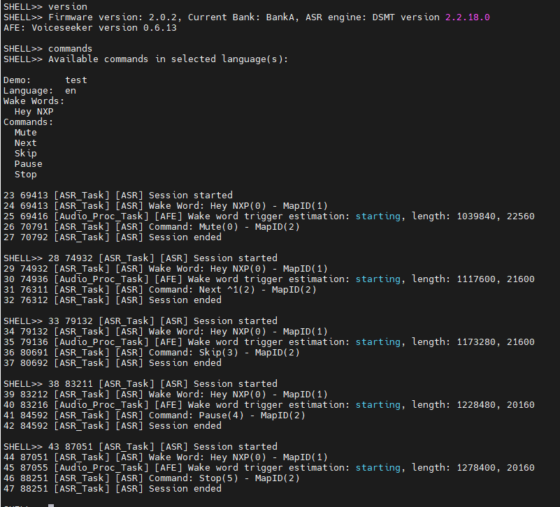