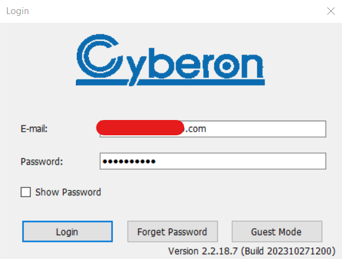
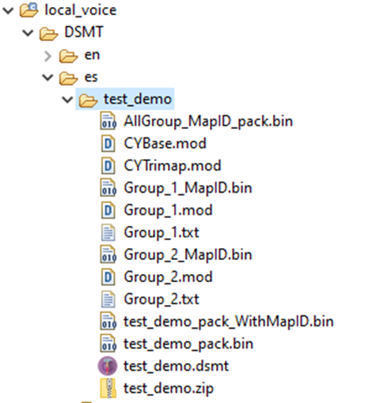

# Example 2 - Add a new ES model

The purpose of this example is to add a Spanish model next to the existing English one.

Both models will use the same demo actions and prompts.

The patch ex2_dsmt.patch [can be applied](../../../README.md#applying-patches) to obtain the end-result of this example.

## Start from the content of DSMT example 1

- Right click on sln_svui_iot_local_demo_dsmt_ex_1, then click on "Copy"
- Right click in the workspace, then click on "Paste"
- You will be asked to give a name to the copied instance. Use **sln_svui_iot_local_demo_dsmt_ex_2**
- Make sure you have the correct version of SDK (2.16.0). In case you don't, please follow the instructions from the main README on [how to download and install it](../../../README.md#download-mimxrt1060-evkc-v2.16.0-sdk)

## Add new folder structure for es language

- Copy all sources from **en** folder, then rename from en_* to es_*
- Every source will be modified later on


## Creating a new DSMTv2 project

- Open "Cyberon DSpotter Modeling Tool V2"
- Cyberon login page will open



- Go to File -> New Project


- Add a name for your project and select the language from the "Language" drop-down list
- Press OK


- Then confirm project settings


- The only thing that can be modified currently is the Model Size Level:
    - The bigger the model, the better the detection, especially in noisy conditions
    - CPU and RAM usage will increase, but we support even the biggest model size (4) with our solution. We recommend biggest model for best performance

- You will then be asked to select a folder in which the project will be saved
- For ease of use it is simpler to save the .dsmt project in the language folder of the MCUXpresso project because the voice model binary is created in the same folder as the .dsmt file
- So when you modify the model, you will just save it (Ctrl + S or File -> Save project) and the resulted binary will be updated in the same folder from where it is used by the MCUXpresso project, i.e. you will not need to copy - paste the model from a different location


## Creating a new DSMTv2 project - Adding wake words

Group_1 should be used for wake words.
For this example we will add an entry for "Hola NXP"
All wake words must be edited to have CmdMapId value set to 1 instead of the default -1.

This can be done either by double clicking on the inserted command or by clicking on it, then on the edit button.

> [!NOTE]
> If the text for the command is modified in the "Edit command" window, this will not modify the phonemes! (it is easier to re-add a command if needing to change it, than to edit it, because it will be needed to edit the phonemes as well).


## Creating a new DSMTv2 project - Adding commands

- First it is needed to add a new Group from the menu: Group -> Insert
- CmdMapID will need to be changed to the group index value, in our case 2
- If we would insert an additional group of commands, we would need to use CmdMapID value 3 for it
- For this example we will add the following commands: Silencio, Siguiente, Salta, Pausa, Détente


## Generating the voice model binary

- Check the MapID box. It generates test_demo_pack_WithMapID.bin, which is what we will use for integration in the firmware


- Save the project (Ctrl + S or File -> Save project)
- The test_demo folder should look as shown below



## Integrate the DSMT model in sln_svui_iot_local_demo

1. Update **_local_voice/DSMT/demo_definitions_dsmt.h_**:
    - Update `asr_language_t` so that it knows about Spanish language as well.
    ```c
    /* Enumeration of the languages supported by the project
    * Add, remove or replace languages here, but keep the one bit
    * per language allocation, as currently implemented.
    * The code assumes one bit allocation per definition */
    typedef enum _asr_languages
    {
        UNDEFINED_LANGUAGE = 0,
        ASR_FIRST_LANGUAGE = (1U << 0U),
        ASR_ENGLISH        = (1U << 0U),
        ASR_SPANISH        = (1U << 1U),
        ASR_ALL_LANG       = (ASR_ENGLISH | ASR_SPANISH)
    } asr_language_t;
    ```

    - Update num languages.
    ```c
    /* languages supported in the firmware (not necessarily running at the same time)
    * this number can be increased depending on the project needs */
    #define NUM_LANGUAGES (2)
    ```

    - Update the shell printing-related strings.
    ```c
    /* Strings used for shell printing or shell commands */
    #define LANG_STR_EN "en"
    #define LANG_STR_ES "es"

    #define DEMO_STR_TEST_DEMO "test"

    #define SHELL_SELECTABLE_DEMOS DEMO_STR_TEST_DEMO
    #define SHELL_SELECTABLE_LANGUAGES LANG_STR_EN " " LANG_STR_ES
    ```

2. Update **_local_voice/DSMT/es/es_strings_dsmt.h_**:
    - This file contains strings associated with the commands from the model
    - Please note that you need to modify the preproc definitions as well, must change the `EN_EN` to `ES_ES`
    ```c
    #ifndef DSMT_ES_ES_STRINGS_DSMT_H_
    #define DSMT_ES_ES_STRINGS_DSMT_H_

    #if ENABLE_DSMT_ASR

    /* Spanish demos strings below.
    * These must match the DSMTv2 groups */

    const char * const ww_es[] = {
            "Hola NXP"
    };

    const char * const cmd_test_demo_es[] = {
            "Silencio",
            "Siguiente",
            "Salta",
            "Pausa",
            "Détente",
    };

    #endif /* ENABLE_DSMT_ASR */
    #endif /* DSMT_ES_ES_STRINGS_DSMT_H_ */
    ```

3. Update **_local_voice/DSMT/es/es_strings_to_actions_dsmt.h_**:
    - This is basically an association between DSMT commands entries and actions from demo_actions_dsmt.h
    ```c
    #ifndef DSMT_ES_ES_STRINGS_TO_ACTIONS_DSMT_H_
    #define DSMT_ES_ES_STRINGS_TO_ACTIONS_DSMT_H_

    #if ENABLE_DSMT_ASR

    #include "demo_actions_dsmt.h"
    #include "stdint.h"

    const int16_t actions_ww_es[] = {
        kWakeWord_Detected, // "Hola NXP"
    };

    const int16_t actions_test_demo_es[] = {
        kTestDemo_Mute,  // "Silencio"
        kTestDemo_Next,  // "Siguiente"
        kTestDemo_Skip,  // "Salta"
        kTestDemo_Pause, // "Pausa"
        kTestDemo_Stop,  // "Détente"
    };

    #endif /* ENABLE_DSMT_ASR */
    #endif /* DSMT_ES_ES_STRINGS_TO_ACTIONS_DSMT_H_ */
    ```

4. Update **_local_voice/DSMT/es/es_strings_to_prompts_dsmt.h_**:
    - If no prompts are required, entries can be set to NULL
    - In this integration, we are reusing the OK prompt when one of the new commands is detected
    - Integrating new prompts will be shown in a separate section
    ```c
    #ifndef DSMT_ES_ES_STRINGS_TO_PROMPTS_DSMT_H_
    #define DSMT_ES_ES_STRINGS_TO_PROMPTS_DSMT_H_

    #if ENABLE_DSMT_ASR

    #include "sln_flash_files.h"

    const char * const prompts_ww_es[] = {
        AUDIO_WW_DETECTED, // "Hola NXP"
    };

    const char * const prompts_test_demo_es[] = {
        AUDIO_OK_EN, // "Silencio"
        AUDIO_OK_EN, // "Siguiente"
        AUDIO_OK_EN, // "Salta"
        AUDIO_OK_EN, // "Pausa"
        AUDIO_OK_EN, // "Détente"
    };

    #endif /* ENABLE_DSMT_ASR */
    #endif /* DSMT_ES_ES_STRINGS_TO_PROMPTS_DSMT_H_ */
    ```

5. Update **_local_voice/DSMT/es/es_voice_demos_dsmt.h_**:
    - This file is used to define demo structure. Change all **en** to **es**
    ```c
    #ifndef DSMT_ES_ES_VOICE_DEMOS_DSMT_H_
    #define DSMT_ES_ES_VOICE_DEMOS_DSMT_H_

    #if ENABLE_DSMT_ASR

    #include "sln_voice_demo.h"
    #include "es_strings_dsmt.h"
    #include "es_strings_to_actions_dsmt.h"
    #include "es_strings_to_prompts_dsmt.h"
    #include "stddef.h"

    extern unsigned int es_model_begin;

    const sln_voice_demo_t demo_test_demo_es =
    {
        ww_es,                          // wake word strings
        cmd_test_demo_es,               // command strings
        actions_ww_es,                  // wake word actions
        actions_test_demo_es,           // command actions
        prompts_ww_es,                  // wake word prompts
        prompts_test_demo_es,           // command prompts
        NULL,                           // prompt for demo announcement
        NUM_ELEMENTS(ww_es),            // number of wake words
        NUM_ELEMENTS(cmd_test_demo_es), // number of commands
        &es_model_begin,                // pointer to model
        ASR_SPANISH,                    // what language is used
        ASR_CMD_TEST_DEMO,              // what demo is used
        LANG_STR_ES,                    // language string
        DEMO_STR_TEST_DEMO,             // demo string
    };

    #endif /* ENABLE_DSMT_ASR */

    #endif /* DSMT_ES_ES_VOICE_DEMOS_DSMT_H_ */
    ```

6. Update **_local_voice/DSMT/es/es_voice_model_binary_dsmt.s_**:
    - This file is used to point to the voice model binary
    ```c
    .global es_model_begin

    es_model_begin:
    .incbin "./es/test_demo/test_demo_pack_WithMapID.bin"
    es_model_end:
    ```

7. Update **_local_voice/DSMT/voice_demos_dsmt.c_**:
    - Add a demo entry for the new Spanish demo
    ```c
    #if ENABLE_DSMT_ASR

    #include "demo_definitions_dsmt.h"
    #include "en_voice_demos_dsmt.h"
    #include "es_voice_demos_dsmt.h"
    #include "sln_voice_demo.h"

    sln_voice_demo_t const * const all_voice_demos_dsmt[] = {
        &demo_test_demo_en,
        &demo_test_demo_es,
        NULL // end with NULL to signal list ending
    };

    #endif /* ENABLE_DSMT_ASR */
    ```

## Add es folder to include paths in project settings

Otherwise you would get a compilation error saying the header is not found.


- Right click on project, select "Properties"
- Go to "C/C++ General" -> "Paths and Symbols"	
- On "Includes" tab, click on "GNU C", then on "Add"
- On the newly opened window, click on "Workspace"
- Navigate to the local_voice/DSMT/es folder, click on "es" then on "OK"
- Check all checkboxes, then click "OK"


## Updating app version

It's always a good idea to update application version when planning to update via [MSD](../../../README.md#msd-update) because it will be an easy way to check if the binary got updated, by calling command `version` in the shell.

The binary version definitions are found in **_source/app.h_**.
```c
/* Application version */
#define APP_MAJ_VER                    0x02
#define APP_MIN_VER                    0x00
#define APP_BLD_VER                    0x0003
```

## Test the new project

- Project compilation should now be successful
- Generate the binary and use it for an MSD update
- Command `version` should print 2.0.3
- Command `help` should display "es" language as available to change to
- Change to es by using command `changelang es`
- Command `commands` should list the newly added commands
Say the wake word followed by one of the commands to test the detection

 <br> </br>

