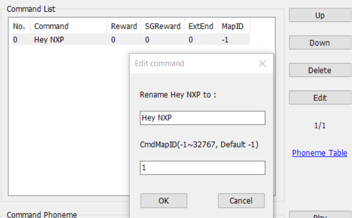
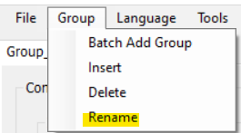
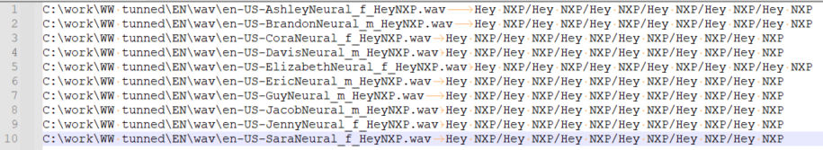
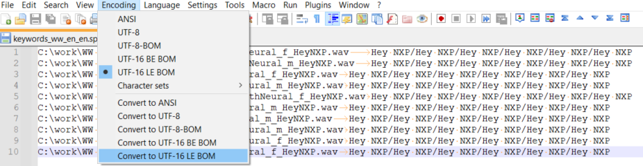
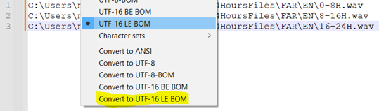
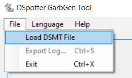
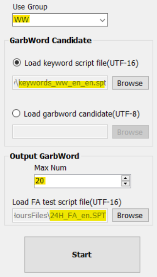
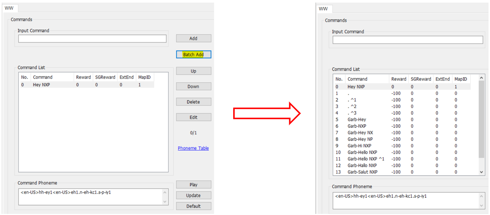

# Example 3 - Test and tune a DSMT model

The purpose of this example is to tune an English DSMT model.

## Create a DSMT English model

- Choose the Model Size Level and keep the other default settings
- Add the "Hey NXP" wake word
- Change MapID to 1

- Rename the group to **WW** (optional)

## Preparations needed

- Download [DSpotter GarbGen Tool](http://tool.cyberon.com.tw/DSpotterGarbGenTool/index.php?lang=en)
- Multiple voices (male and female) are needed (e.g. 5 male voices, 5 female voices)
- Every voice repeats the wake word multiple times with different pitch/speed
- The recordings must be **.wav** files saved in the following format: Sampling Rate 16000Hz, Resolution: 16bit, mono channel, PCM

- Example tools to use: 
    - [ttsmp3.com](https://ttsmp3.com/)
    - [Microsoft Azure Text to Speech](https://azure.microsoft.com/en-us/services/cognitive-services/text-to-speech/)
    - Actual people uttering the wake word
        - For a better coverage, the recordings can be done closer to the microphone (Near Field) and farther from the microphone (Far Field)

- Create a **.spt** file in which you include the absolute paths to the **.wav** files and the list of uttered words during the recordings separated by **TAB** 

> [!NOTE]
> Use **TAB** after the .wav files. Do NOT use space.
> if the uttered word is repeated during the recording multiple times, write it for each time it was uttered and separate the occurrences with '/'

- In order to create the **.spt** file, Notepad++ can be used as such:
    - Open Notepad++
    - Write the contents as instructed
    - Press CTRL-S or File -> Save as (button is located in the upper left corner)
    - In the "Save as type" drag menu select "All types"
    - Write your file name and end it with .spt

- In the example below, there are 10 recordings (5 male voices, 5 female voices). The wake word was uttered in six different ways by each voice

- Convert the file to UTF-16 LE BOM (e.g. by using Notepad++)

- Create a **.spt** file that includes recordings (wav files) of anything except the wake word that needs tuning
    - We recommend 24h news
    - The .wav file of the recorded news should not exceed 2GB, otherwise it has to be split in multiple files
    - The recordings must be **.wav** files saved in format: Sampling Rate 16000Hz, Resolution: 16bit, mono channel, PCM
- Add the absolute paths to the wav files
- Convert the spt file to UTF-16 LE BOM

## Automatically generating garbage words

- Load the DSMT file into GarbGen Tool for generating the garbage words

- Choose a group to tune (WW)
- Load the .spt file that includes the uttered wake word (keyword script file)
- Choose a maximum number for the garbage words
    - If max Num is a large number, the detection model will become more aggressive and the command will have to be said in a very accurate way
- Load the .spt file of the news (FA test script file)
- Press **Start**

> [!NOTE]
> It might take a while until the tuning is finished

## Integrate automatically generated garbage words

- Unzip the contents from /DSpotterGarbGen_Output/oob_demo_en_xxxxxxxxxxxxxx.zip
> [!NOTE]
> For our example the DSMT project name is "oob_demo_en"
- Replace the DSMT file found at local_voice/DSMT/en with the DSMT file from the unzipped folder
- It is also possible instead to **Batch Add** the newly created WW.txt file found at /DSpotterGarbGen_Output/oob_demo_en_xxxxxxxxxxxxxx/ but in this case all of the previous commands need to be deleted in order to avoid duplicates.
- In both cases, **MapID** has to be changed to 0 for the generated **garbage** words and **Reward** should be set to -100 if not already at that value.

- More garbage words can be added manually
- Command phonemes can be modified manually - need to click **Update** after modifying them
- Use **Up** or **Down** to move a wake word or garbage word if needed

- Check MapID box - this will generate the new **oob_demo_en_pack_WithMapID.bin**
- Save the project

## Manually adding garbage words

- Let's say we have a 4-syllable wake word "ABCD":
    - Remove one syllable and add the following garbage words:
        - "ABC", "ABD", "ACD"
        - Do not use "BCD"
    - Change the vowel of each syllable as much as possible:
        - "ae-BCD", "ao-BCD", "au-BCD", "A-ba-CD", "A-bo-CD", etc
    - Identify (and remove) garbage words that reduce detection rate by the test tool 

- More information about the tool or how to tune a DSMT model can be found here:
    - [http://tool.cyberon.com.tw/DSpotterGarbGenTool/index.php?lang=en](http://tool.cyberon.com.tw/DSpotterGarbGenTool/index.php?lang=en)
    - [Cyberon Youtube channel](https://www.youtube.com/watch?v=RZ308xVS3Cc&list=PLTEknqO5GAbrDX5NMs-P6b9THWwamgVBo&index=1&ab_channel=cyberon)

## Integrating the new model

- Overwrite **oob_demo_en_pack_WithMapID.bin** from your MCUXpresso project
- Clean and build the project
- Use the new binary for [MSD](../../../README.md#msd-update)