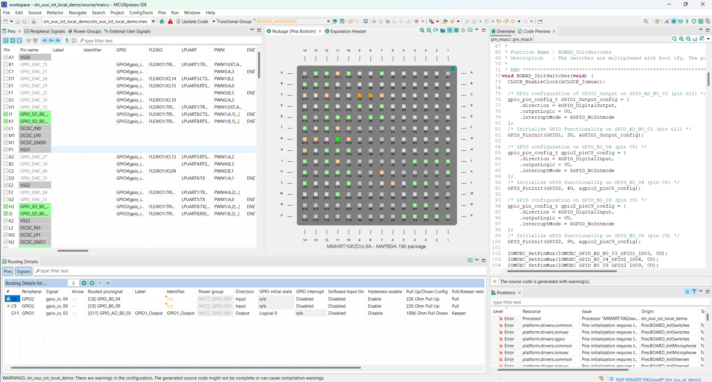

# Add GPIO functionality coupled with voice commands

The purpose of this example is to use the pins available on the board and power an external peripheral

Additionally, we will associate the signals coming from the used pins with the action taken when a specific command is detected

## MCUXpresso Pins View
This is the View which we will use for any pin configurations and signal reroutes. For this particular setup we will be working exclusively with pin **G11** as UART is not needed for the OOB scenario.

<br/><br/>
> [!NOTE]
> Changes made manually inside the **pin_mux.c** and **pin_mux.h** files may make the pin_mux.c and pin_mux.h files incompatible with the MCUXpresso Pins tool. In order to avoid this situtation we will exclusively use the MCUXpresso Pins View

## Steps to be taken
For this example, we will add new GPIO actions based on what command is detected, by doing the following:
- Changing the peripheral device type from LPUART6 to **GPIO1**
- Modifying the signal from RX to **gpio_io, 03**
- Changing signal direction from Not Specified to **Output**
- Connect a simple breadboard LED circuit to the corresponding physical pins
- Modify the app_layer API to associate actions with pin signals

## Select the pin used for the setup
- In order to select pin G11 we will first need to enter the pin GUI on MCUXpresso. 

<br/><br/>
- In the center of the screen, a diagram containing all chip pins is available for us to modify.

- Right click on pin G11 and choose the last option, "Select the "BOARD_InitLPUART" function routing the pin.

<br/><br/>

## Change pin attributes
- On the bottom of the screen there are now listed all pins routed and initialized inside the same function in the pin_mux.c file.

- Change the peripheral associated with pin G11 from LPUART6 to GPIO1

<br/><br/>
- Change the signal from RX to gpio_io, 03

<br/><br/>
- Change signal direction from 'Not Specified' to Output
> [!NOTE]
> You may receive a warning related to the Identifier column not being specified. You can either safely ignore this warning in this case or write any Identifier in the column 

<br/><br/>

## Initialize the rerouted pin
- On the upper side of the screen, press on the 'Pins' tab and select 'Functional Groups

<br/><br/>
- Select 'Full pins initialization' and press 'OK'

<br/><br/>
- This option makes it so that the pins are initialized in pin_mux.c in the function named after the selected functional group.

<br/><br/>

## Associate actions with pin signal

- For this step we will first remove the APP_LAYER_ProcessVoiceCommand function located in source/app_layer_nxp.c
- In source/app_layer.c, do the following:
    - Include the header "demo_actions.h"
    - Right after the prompts playback in APP_LAYER_ProcessVoiceCommand, get the action associated with the keyword id
    - Assign a different signal depending on the action id
    - For the purposes of this example, we associated writing 1 on the pin with the 'Turn on the lights' command and writing 0 with the "Turn off the lights" command. 
```c
    __attribute__ ((weak)) status_t APP_LAYER_ProcessVoiceCommand(oob_demo_control_t *commandConfig)
{
    status_t status = kStatus_Success;

#if ENABLE_STREAMER
    char *prompt = NULL;
    if (commandConfig != NULL)
    {
        /* Play prompt for the active language */
        prompt = get_prompt_from_keyword(commandConfig->language, commandConfig->commandSet, commandConfig->commandId);

        if (NULL != prompt)
        {
            APP_LAYER_PlayAudioFromFileSystem(prompt);
        }
    }

    uint16_t action = get_action_from_keyword(commandConfig->language,
                                                             commandConfig->commandSet,
                                                             commandConfig->commandId);
    switch (action) {
    	case kSmartHome_TurnOnTheLights: {
    		GPIO_PinWrite(GPIO1, 3U, 1U);
    		break;
    	}
    	case kSmartHome_TurnOffTheLights: {
    		GPIO_PinWrite(GPIO1, 3U, 0U);
    		break;
    	}

    }
#endif /* ENABLE_STREAMER */

    if (status == kStatus_Success)
    {
        APP_LAYER_LedCommandDetected();
    }
    else
    {
        APP_LAYER_LedError();
    }

    return status;
}
```
> [!NOTE]
> The GPIO_PinWrite function receives as parameters the GPIO type (in our case GPIO1), the initialized pin (selected automatically when we checked the 'Full Pins Initialization' option previously) and the written output (1U when turning the LED on and 0U when turning it off).

## Physical Setup
- Now that the pin signal has been rerouted and the corresponding actions have been added the last remaining step is to connect the serial pins to the breadboard containing our simple LED setup.
- Pin 16 is connected to Ground while Pin 6 is the pin that we rerouted the signal for in the previous steps.
- The resistor utilized here has a nominal resistance of 250 ohms

<br/><br/>

## Updating app version

It's always a good idea to update application version when planning to update via [MSD](../../../README.md#msd-update) because it will be an easy way to check if the binary got updated, by calling command 'version' in the shell.

The binary version definitions are found in **_source/app.h_**.
```c
/* Application version */
#define APP_MAJ_VER 0x01
#define APP_MIN_VER 0x01
#define APP_BLD_VER 0x000C
```

## Test the new project
Project compilation should now be successful.
- Generate the binary and use it for an MSD update
- Command `version` should print 1.1.12
- Say the wake word followed by the "Turn on the lights command" to test the detection, then check the EXTERNAL LED behavior
