# Add PWM and GPIO functionality coupled with voice commands

The purpose of this example is to use the pins available on the board to help power an external DC motor which raises and lowers a set of blinds via the L293D motor driver.

For this demo, the components that we have used are the following:
- 1 L293D motor driver
- 1 DC motor with a reducer, with 430 RPM and which operates at a voltage between 3-6V
- An external power source which provides 7.5V and 0.5mA
- 1 Breadboard

> [!NOTE]
> The L293D motor driver can be substituted with a more modern H-Bridge and the same goes for the other components. These components have been chosen purely for ease of use and accesibility

Additionally, we will associate the signals coming from the used pins with the action taken when a specific command is detected

## MCUXpresso Pins View
This is the View which we will use for any pin configurations and signal reroutes. For this particular setup we will be working exclusively with pins **G11, D11 and C13** as UART is not needed for the OOB scenario.

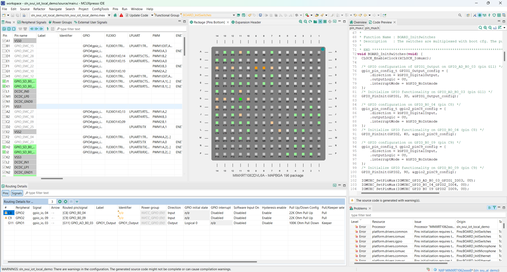<br/><br/>

> [!NOTE]
> Changes made manually inside the **pin_mux.c** and **pin_mux.h** files may make the pin_mux.c and pin_mux.h files incompatible with the MCUXpresso Pins tool. In order to avoid this situtation we will exclusively use the MCUXpresso Pins View

## Steps to be taken
For this example, we will add both GPIO and PWM actions based on what command is detected, by doing the following:

- Changing the peripheral device type for pin **G11**, from LPUART6 to **GPIO1**
- Modifying the signal for pin **G11** from RX to **gpio_io, 03**
- Enabling signals on pins **D11** and **C13** as follows:
    - GPIO2:gpio_io,19 for pin **D11**
    - FLEXIO3:IO,27 for pin **C13**
- Changing signal direction for all three pins from Not Specified to **Output**
- Connecting the setup to the corresponding physical pins
- Modifying the **app_layer API** to associate actions with pin signals

## Select the pins used for the setup
- In order to select our pins we will first need to enter the pin GUI on MCUXpresso. 

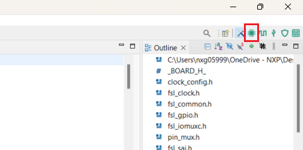<br/><br/>
- In the center of the screen, a diagram containing all chip pins is available for us to modify.

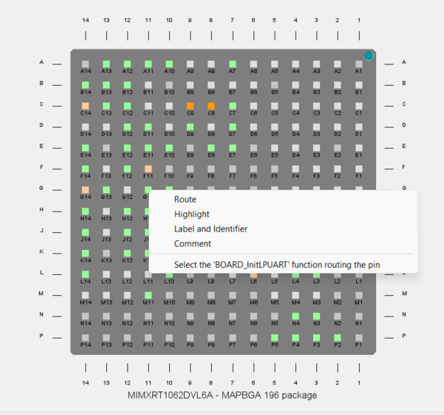<br/><br/>
- Right click on pin G11 and choose the last option, "Select the 'BOARD_InitLPUART' function routing the pin".

## Change pin attributes
- On the bottom of the screen there are now listed all pins routed and initialized inside the same function in the pin_mux.c file.

- Change the peripheral associated with pin G11 from LPUART6 to GPIO1

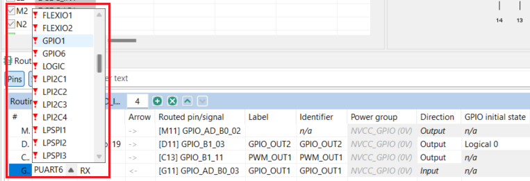<br/><br/>
- Change the signal from RX to gpio_io, 03

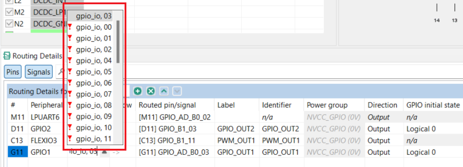<br/><br/>
- Left click on pin D11 and select signal GPIO2:gpio_io,19 from the list

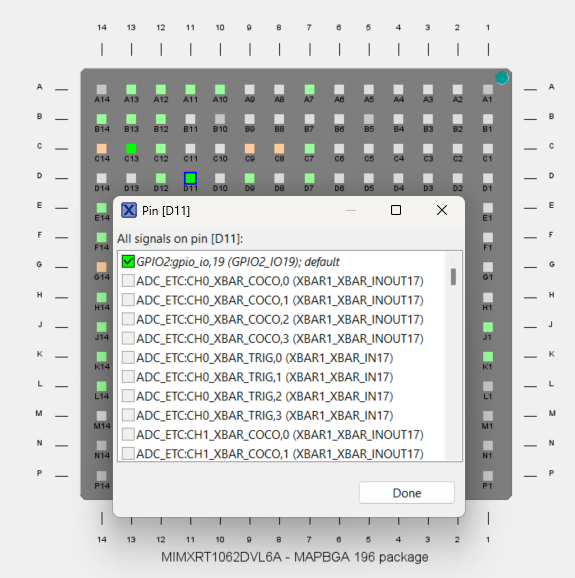<br/><br/>
- Left click on pin C13 and select signal FLEXIO3:IO,27 from the list

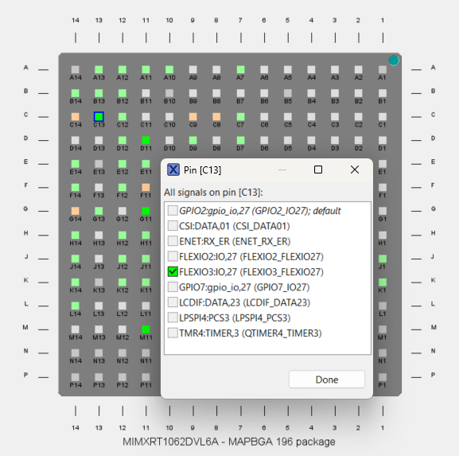<br/><br/>
- Change signal direction for the three pins from 'Not Specified' to Output
> [!NOTE]
> You may receive a warning related to the Identifier column not being specified. You can either safely ignore this warning in this case or write any Identifier in the column 

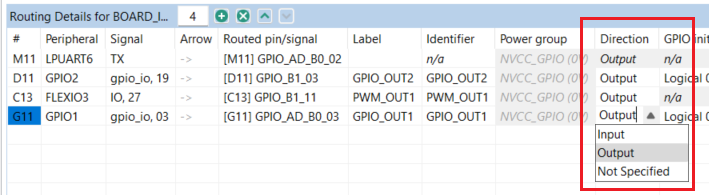<br/><br/>

## Initialize the rerouted pin
- On the upper side of the screen, press on the 'Pins' tab and select 'Functional Groups'

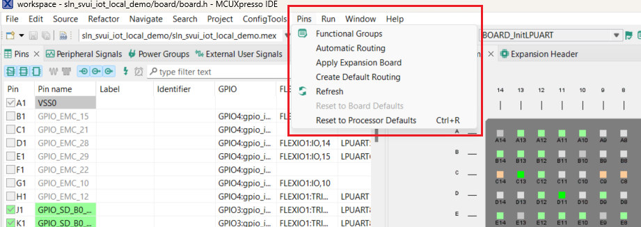<br/><br/>
- Select 'Full pins initialization' and press 'OK'

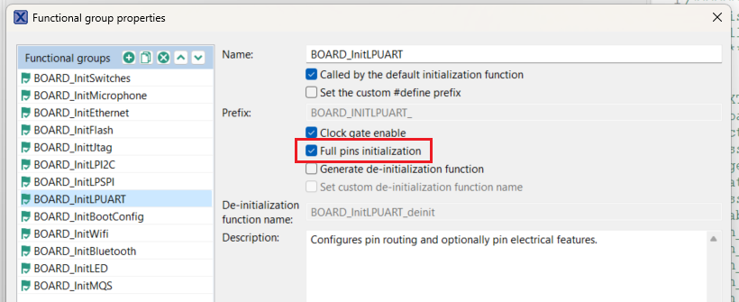<br/><br/>
- This option makes it so that the pins are initialized in pin_mux.c in the function named after the selected functional group.

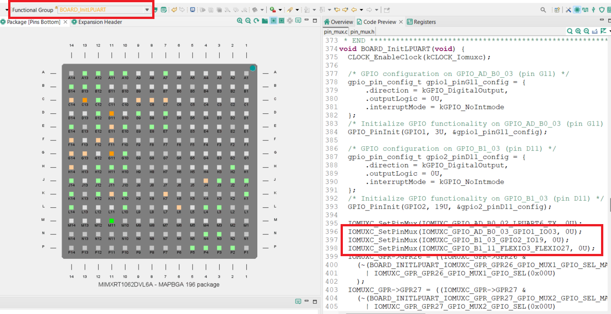<br/><br/>

## Associate actions with pin signals

For this part of the demo we will make the following additions in the codebase:

- Create a driver for the DC motor to be used with PWM in both directions
- Initialize the PWM module in the **main.c** file
- Make the `_flexio_pwm_init` function inside **sln_RT10xx_RGB_LED_driver_flexio.c** non-static so that we can use it in our demo.
- Add cases which associate vocal commands with motor actions inside the **app_layer API**

## Code changes to be made

We will first create two new files at sln_svui_iot_local_demo/source/ : **sln_pwm_driver_flexio.c** and **sln_pwm_driver_flexio.h**

After this, do the following changes:
- Inside **sln_pwm_driver_flexio.h** write the following:
```c
#ifndef SLN_PWM_DRIVER_FLEXIO_H_
#define SLN_PWM_DRIVER_FLEXIO_H_

#include "fsl_common.h"

status_t FlexPWM_Init(void);

void PWM_SetDutyCycle(uint32_t duty_cycle);

void PWM_DriveBlinds(uint8_t percentage_open);

void _flexio_pwm_init(uint32_t freq_Hz, uint32_t duty, uint8_t channel, uint8_t pwm_pin);

#endif /* SLN_PWM_DRIVER_FLEXIO_H_ */
```
- In the **board.h** header file include the following macros:
```c
/*! @brief PWM and GPIO configuration for external motor */
#define FLEXIO_PWM_TIMER_CH    (3U)
#define FLEXIO_PWM_OUTPUTPIN   (27U)
#define GPIO_DRIVER_OUTPUTPIN1 (3U)
#define GPIO_DRIVER_OUTPUTPIN2 (19U)
```
- Inside **sln_pwm_driver_flexio.c** write:
```c
#include "FreeRTOS.h"
#include "task.h"
#include "board.h"
#include "fsl_flexio.h"
#include "sln_pwm_driver_flexio.h"

#define TIME_TO_POWER 82U

/*  For convenience, we assume that the blinder is fully opened at boot time  */
uint8_t current_percentage_open = 100U;

status_t FlexPWM_Init(void)
{
    flexio_config_t fxioUserConfig;

    FLEXIO_GetDefaultConfig(&fxioUserConfig);
    FLEXIO_Init(FLEXIO3, &fxioUserConfig);

    return kStatus_Success;
}

void PWM_SetDutyCycle(uint32_t duty_cycle)
{
    _flexio_pwm_init(LED_FLEXIO_FREQUENCY, duty_cycle, FLEXIO_PWM_TIMER_CH, FLEXIO_PWM_OUTPUTPIN);
    if (duty_cycle != 0)
    {
        LED_FLEXIO_BASEADDR->TIMCTL[FLEXIO_PWM_TIMER_CH] |= FLEXIO_TIMCTL_TIMOD(kFLEXIO_TimerModeDual8BitPWM);
    }
}

void PWM_DriveBlinds(uint8_t percentage_open)
{
    int8_t percentage_to_open;
    percentage_to_open = (int8_t)current_percentage_open - (int8_t)percentage_open;

    if (percentage_to_open < 0)
    {
        /*  IN1 for H-Bridge  */
        GPIO_PinWrite(GPIO1, GPIO_DRIVER_OUTPUTPIN1, 1U);
        /*  IN2 for H-Bridge  */
        GPIO_PinWrite(GPIO2, GPIO_DRIVER_OUTPUTPIN2, 0U);
        PWM_SetDutyCycle((uint32_t)99);
        vTaskDelay(TIME_TO_POWER * percentage_to_open * (-1));
        GPIO_PinWrite(GPIO1, GPIO_DRIVER_OUTPUTPIN1, 0U);
        PWM_SetDutyCycle((uint32_t)0);
    }
    else if (percentage_to_open > 0)
    {
        /*  IN1 for H-Bridge  */
        GPIO_PinWrite(GPIO1, GPIO_DRIVER_OUTPUTPIN1, 0U);
        /*  IN2 for H-Bridge  */
        GPIO_PinWrite(GPIO2, GPIO_DRIVER_OUTPUTPIN2, 1U);
        PWM_SetDutyCycle((uint32_t)50);
        vTaskDelay(TIME_TO_POWER * percentage_to_open);
        GPIO_PinWrite(GPIO2, GPIO_DRIVER_OUTPUTPIN2, 0U);
        PWM_SetDutyCycle((uint32_t)0);
    }
    current_percentage_open = percentage_open;
}
```
- In **/source/main.c** initialize the PWM signal
```c
    RGB_LED_Init();
    RGB_LED_SetColor(LED_COLOR_GREEN);

    FlexPWM_Init();

#if ENABLE_SHELL
    sln_shell_init();
#elif ENABLE_UART_CONSOLE
    BOARD_InitDebugConsole();
#endif /* ENABLE_SHELL */
```
- In **/source/sln_RT10xx_RGB_LED_driver_flexio.c** include **sln_pwm_driver_flexio.h** and make the `_flexio_pwm_init` function non-static
```c
#include "sln_pwm_driver_flexio.h"
/*
...
*/
void _flexio_pwm_init(uint32_t freq_Hz, uint32_t duty, uint8_t channel, uint8_t pwm_pin)
```
- In **/source/app_layer_nxp.c** include the following headers and associate the PWM_RaiseBlinds() and PWM_LowerBlinds() functions defined in sln_pwm_driver_flexio.c with the MakeItBrighter and MakeItDarker actions processed in the **APP_LAYER_ProcessVoiceCommand** function
```c
#include "sln_pwm_driver_flexio.h"

#include "fsl_gpio.h"
/*
...
*/
status_t APP_LAYER_ProcessVoiceCommand(oob_demo_control_t *commandConfig)
{
    status_t status = kStatus_Success;
    uint16_t action = 0;

    if (commandConfig != NULL)
    {
        action = get_action_from_keyword(commandConfig->language, commandConfig->commandSet, commandConfig->commandId);

#if ENABLE_STREAMER
        char *prompt = NULL;

        /* Play prompt for the active language */
        prompt = get_prompt_from_keyword(commandConfig->language, commandConfig->commandSet, commandConfig->commandId);

        if (NULL != prompt)
        {
            APP_LAYER_PlayAudioFromFileSystem(prompt);
        }

        switch(action) {
            case kSmartHome_MakeItBrighter:
            {
                PWM_DriveBlinds(100U);
                break;
            }
            case kSmartHome_MakeItDarker:
            {
                PWM_DriveBlinds(0U);
                break;
            }
        }
/*
...
*/
    }
}
#endif /* ENABLE_STREAMER */
```
## Physical Setup
- Now that the pin signals have been rerouted and the corresponding actions have been added the last remaining step is to connect the serial pins to the breadboard containing our DC motor setup.
- Board pin 16 is connected to Ground, Board pin 14 is connected to the driver Vcc1(Vss) driver pin, board pin 2 is connected to the Enable 1,2 driver pin, and board pins 4 and 6 are connected to the Input 2, respectively Input 1, driver pins.
- The driver Vcc2(Vs) pin is connected to an external power source which in this case provides 7.5V and 0.5mA and one of the driver ground pins is connected to the same ground as the board.
> [!NOTE]
> The L239D driver is susceptible to voltage drops: the 7.5V supplied turns into aproximately 6V at the driver Output pins, the maximum operating voltage for our motor.
- Driver Output 1 and 2 pins are connected to the DC motor.

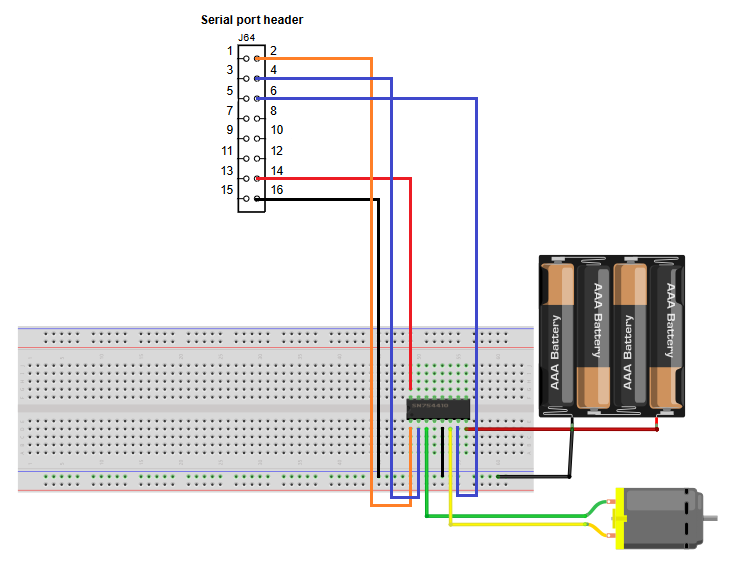<br/><br/>

## Updating app version

It's always a good idea to update application version when planning to update via [MSD](../../../README.md#msd-update) because it will be an easy way to check if the binary got updated, by calling command "version" in the shell.

The binary version definitions are found in **_source/app.h_**.
```c
/* Application version */
#define APP_MAJ_VER 0x01
#define APP_MIN_VER 0x01
#define APP_BLD_VER 0x000D
```

## Test the new project
Project compilation should now be successful.
- Generate the binary and use it for an MSD update
- Command `version` should print 1.1.13
- Say the wake word followed by the "Make it darker" command to test the detection, then check the PWM motor behaviour


