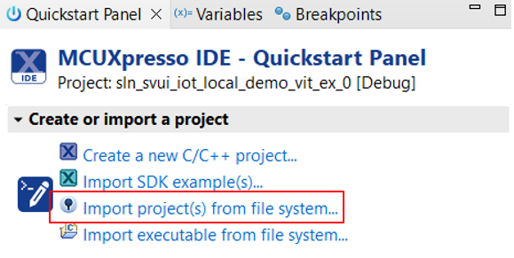
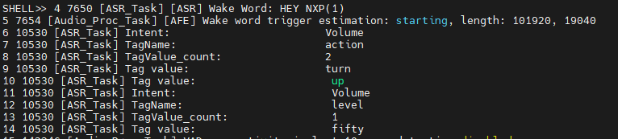

# Example 0 - Add a new EN model

In this example we will remove all existing S2I models and we will add a new S2I English model.

**IMPORTANT:** This example assumes that the S2I model generation tool documentation was read and fully understood - ADD LINK TO DOCUMENTATION.

## Generate a new S2I model

- Navigate to this URL: [https://vit.nxp.com/#/home](https://vit.nxp.com/#/home) - UPDATE LINK HERE
- Login with your nxp.com account
- Follow the dedicated documentation for generating a new S2I model
- Download the resulting archive

## Pre-generated model

- For this exemple a pre-generated audioplayer model will be used, available in the resources folder (it contains all files that can be found in the package downloaded after using the model creation tools).
- Wake-word:
    - Hey NXP
- Intents (over 1400 supported expressions, all listed in resources/sentences.txt). Looking in the VIT_Model_en.h file you will notice that the intents are listed as tuples. Each intent has one or more tags and each tag has multiple values. For this model the intents are:
    - [Music]  - {action} - next | previous | start | stop | pause | play
    - [Volume]  - {action} - turn up | raise | increase | turn down | reduce | decrease | lower
    - [Volume] - {level}  - min | minimum | max | maximum | 10 | 20 | ... | 90

## Import a new instance of the project

- Make sure you have the correct version of SDK (2.16.0). In case you don't, please follow the instructions from the main README on [how to download and install it](../../../README.md#download-mimxrt1060-evkc-v2.16.0-sdk)

- Open MCUXpresso IDE, then click on "Quickstart Panel" -> "Import projects from file system"



- Browse to where the repo was cloned and select `sln_svui_iot_local_demo` folder
- Press "Next", then leave the default options selected and press on "Finish"


- For avoiding conflicts with next examples, rename the project to **sln_svui_iot_local_demo_s2i_ex_1** (either Right click on project -> Rename or press F2 and rename window will open)

## Integrate the S2I model in sln_svui_iot_local_demo

1. Copy-paste the new header model in **_local_voice/S2I/en_**
2. The models for HVAC, Oven and Smart Home demos will be deleted


3. Update **_local_voice/S2I/demo_definitions_s2i.h_**:

    - Add a demo entry in `asr_inference_t`. The previous entries for OOBE demos can all be removed.
```c
/* Enumeration of the command sets integrated into the project
* Add, remove or replace the command sets here.
* Keep the one bit per command set allocation, as currently implemented.
* The code assumes one bit allocation per definition */
typedef enum _asr_inference
{
    UNDEFINED_INFERENCE     = 0,
    ASR_S2I_AUDIOPLAYER     = (1U << 0U),
    ASR_CMD_INVALID_DEMO
} asr_inference_t;
```

    - Set `BOOT_ASR_CMD_DEMO` and `DEFAULT_ASR_CMD_DEMO` to `ASR_S2I_AUDIOPLAYER`.
```c
/* demo after first boot. can be used for selecting the demo at the very first board boot */
#define BOOT_ASR_CMD_DEMO ASR_S2I_AUDIOPLAYER

/* default demo. this can have the same value as BOOT_ASR_CMD_DEMO
* in our POC we use BOOT_ASR_CMD_DEMO to give the possibility to the user to select the demo
* via voice commands. If a selection is not made until the timeout is hit, then
* DEFAULT_ASR_CMD_DEMO will be loaded */
#define DEFAULT_ASR_CMD_DEMO ASR_S2I_AUDIOPLAYER
```

    - Update the shell printing-related strings.
```c
/* Strings used for shell printing or shell commands */
#define LANG_STR_EN "en"

#define DEMO_STR_AUDIOPLAYER "audioplayer"
```

    - Delete this define
```c
#define SHELL_SELECTABLE_DEMOS     DEMO_STR_HVAC " " DEMO_STR_OVEN " " DEMO_STR_HOME
```

4. Update **_source/sln_local_voice_s2i.c_** with actions for the new demo:
    - Include the new model and remove the existing ones:
```c
#include "VIT_Model_en.h"
```

    - Update VIT_Init() and set the model to the one I've just added:
```c
switch (appAsrShellCommands.demo)
{
    case ASR_S2I_AUDIOPLAYER:
        VIT_Status = VIT_SetModel((const PL_UINT8 *)VIT_Model_en, VIT_MODEL_IN_FAST_MEM);
        break;
}
```
    - Update the sanity check in local_voice_task():
```c
if ((appAsrShellCommands.status != WRITE_SUCCESS) ||
    ((appAsrShellCommands.demo != ASR_S2I_AUDIOPLAYER)) ||
//        (false == validate_all_active_languages(appAsrShellCommands.activeLanguage, appAsrShellCommands.demo)) ||
    (appAsrShellCommands.version != APP_ASR_SHELL_VERSION))
```

5. Moving to **source/main.c**:
    - Clean announce_demo_s2i() - function responsible for announcing the active demo at runtime (to add new audio demo announcement follow the dedicated exemple, examples/VIT/example_4)
```c
char *prompt = NULL;
switch (demo)
{
    case ASR_S2I_AUDIOPLAYER:
        prompt = NULL; // ADD PROMPT HERE
        break;
}
```
6. Clean the **source/app_layer_nxp_s2i.c** file:
    - In APP_LAYER_SwitchToNextDemo() - remove all switch cases and add one for the new demo:
```c
switch (appAsrShellCommands.demo)
{
    case ASR_S2I_AUDIOPLAYER:
        appAsrShellCommands.demo = ASR_S2I_AUDIOPLAYER;
        break;
    default:
        configPRINTF(("Error: unsupported demo %d\r\n", appAsrShellCommands.demo));
        appAsrShellCommands.demo = ASR_S2I_AUDIOPLAYER;
        break;
}
```
    - In APP_LAYER_ProcessTimeout() - add a new timeout logic for this model or we can add a break statement:
```c
/* appAsrShellCommands.demo contains current demo. */
switch (appAsrShellCommands.demo)
{
    case ASR_S2I_AUDIOPLAYER:
    {
        break;
    }

    default:
    {
        configPRINTF(("Error: Unsupported command set %d\r\n", commandConfig->commandSet));
        status = kStatus_Fail;
        break;
    }
}
```

    - Delete APP_LAYER_SwitchToNewDemo() and update APP_LAYER_ProcessIntent() to match that:
```c
status_t APP_LAYER_ProcessIntent()
{
    status_t status = kStatus_Success;

    if (!oob_demo_control.changeDemoFlow)
    {
        APP_LAYER_LedCommandDetected();
        APP_LAYER_VIT_ParseSpeechIntent();
    }

    return status;
}
```

    - Define a new function responsible for parsing the intents from the audioplayer model, but for now, leave it empty:
```c
static void APP_LAYER_VIT_ParseAudioPlayerIntent(void)
{

}
```

    - Update APP_LAYER_VIT_ParseSpeechIntent() to call the newly defined function:
```c
static void APP_LAYER_VIT_ParseSpeechIntent(void)
{
    if (!APP_LAYER_VIT_ParseChangeDemoIntent())
    {
        switch (appAsrShellCommands.demo)
        {
            case ASR_S2I_AUDIOPLAYER:
                APP_LAYER_VIT_ParseAudioPlayerIntent();
                break;
            default:
                configPRINTF(("[ERROR] Invalid demo id!\r\n"));
                break;
        }
    }
}
``` 
7. Finally, update **source/sln_shell.c**, so the model change will be reflected in the available shell commands:
    - In sln_commands_cmd_action() - delete references to the old models:
```c
SHELL_Printf(s_shellHandle, "\r\nDemo:      ");

switch (appAsrShellCommands.demo)
{
    case ASR_S2I_AUDIOPLAYER:
        SHELL_Printf(s_shellHandle, "audioplayer\r\n");
        break;
}
```

    - In the same function add a short list of the available commands:
```c
SHELL_Printf(s_shellHandle, "Example expressions (full list in expressions.txt):\r\n");

switch (appAsrShellCommands.demo)
{
    case ASR_S2I_AUDIOPLAYER:
        SHELL_Printf(s_shellHandle, "start/stop/pause/play music\r\n");
        SHELL_Printf(s_shellHandle, "next/previous song\r\n");
        SHELL_Printf(s_shellHandle, "set the music volume to max/maximum/min/minimum\r\n");
        SHELL_Printf(s_shellHandle, "turn up the music volume by twenty\r\n");
        SHELL_Printf(s_shellHandle, "raise the music volume by fifty percent\r\n");
        SHELL_Printf(s_shellHandle, "increase the sound volume by ten percent\r\n");
        SHELL_Printf(s_shellHandle, "turn down the music volume by twenty percent\r\n");
        SHELL_Printf(s_shellHandle, "raise the music to maximum\r\n");
        SHELL_Printf(s_shellHandle, "turn down to minimum\r\n");
        SHELL_Printf(s_shellHandle, "turn up to max\r\n");
        break;
}
```

## Updating app version

It is always a good idea to update application version when planning to update via [MSD](../../../README.md#msd-update) because it will be an easy way to check if the binary got updated, by calling command `version` in the shell.

The binary version definitions are found in **_source/app.h_**.
```c
/* Application version */
#define APP_MAJ_VER 0x02
#define APP_MIN_VER 0x00
#define APP_BLD_VER 0x000A
```

## Test the new project

- Project compilation should now be successful
- Generate the binary and use it for an MSD update
- Command `version` should print 2.0.10
- Command `commands` should list the newly added intents
- Say the wake word followed by one of the intents to test the detection


## Link actions with the detected intents

As you may have seen, the function used for parsing the intent - APP_LAYER_VIT_ParseAudioPlayerIntent() - was left empty. It should be used to associate specific actions with the intent that was detected and, depending on the usecase, the actual parsing of the intents, tags and values can be done in multiple ways.

The following implementation can be used to create a 1-to-1 link between an intent and an action (in this case, playing an audio prompt from file system).
[!NOTE]
The process of adding new prompts in the filesystem is described in a different example (**examples/VIT/example_4**). For this exercise the prompt pointer will be set to NULL for all intents.

First, let's declare some auxiliar pointers and variables:
    - pointer to intent's structure
    - counter for storing the index of the last tag
    - pointer to the audio file from flash (as said previously, this one will be redundant before flashing new adio files)
```c
static void APP_LAYER_VIT_ParseAudioPlayerIntent(void)
{
    VIT_Intent_st *pSpeechIntent = NULL;
    PL_INT16 tagsCnt;
    char *prompt = NULL;

    pSpeechIntent = &SpeechIntent;
    tagsCnt = pSpeechIntent->Slot_Tag_count - 1;
}
```

Although we will not have prompts let's also add the prompt playing logic:
```c
static void APP_LAYER_VIT_ParseAudioPlayerIntent(void)
{
    VIT_Intent_st *pSpeechIntent = NULL;
    PL_INT16 tagsCnt;
    char *prompt = NULL;

    pSpeechIntent = &SpeechIntent;
    tagsCnt = pSpeechIntent->Slot_Tag_count - 1;

    /*********************
    ADD PARSING LOGIC HERE
    **********************/

#if ENABLE_STREAMER
    if (prompt != NULL)
    {
        APP_LAYER_PlayAudioFromFileSystem(prompt);
    }
    else
    {
        configPRINTF(("Intent processed successfully but no audio prompt associated to it found.\r\n"));
    }
#endif /* ENABLE_STREAMER */
}
```

Before starting to implement the intent parsing logic lets take a look at the helpful definitions, at the begining of **source/app_layer_nxp_s2i.c** file:
```c
#define INTENT_NAME(x, i)   (x->pIntent[i])
#define TAG_NAME(x, i)      (x->pSlot_Tag[i])
#define TAG_VALUE_CNT(x, i) (x->Slot_Tag_Value_count[i] - 1)
#define TAG_VALUE(x, i, j)  (x->pSlot_Tag_Value[(i * MAX_NUMBER_WORDS_PER_SLOT_TAG_VALUE) + \
                             TAG_VALUE_CNT(x, i) - j])
```
- INTENT_NAME(x, i)   - returns the name of intent with index **i** in intent structure **x** as string
- TAG_NAME(x, i)      - returns the name of tag with index **i** in intent structure **x** as string
- TAG_VALUE_CNT(x, i) - returns the number of values of tag with index **i** in intent structure **x** as integer
- TAG_VALUE(x, i, j)  - returns the **TAG_VALUE_CNT(x, i) - j** value of the tag with index **i** in intent structure **x** as string

To exemplify, we will parse the intent from the image below (the image is a shell capture and the intents are shown in detection order but in the intent's structure they are actually ordered backwards - yoda style)



```c
static void APP_LAYER_VIT_ParseAudioPlayerIntent(void)
{
    VIT_Intent_st *pSpeechIntent = NULL;
    PL_INT16 tagsCnt;
    char *prompt = NULL;

    pSpeechIntent = &SpeechIntent;
    tagsCnt = pSpeechIntent->Slot_Tag_count - 1;

    /*********************
    ADD PARSING LOGIC HERE
    **********************/
   INTENT_NAME(pSpeechIntent, tagsCnt)        // THIS WILL RETURN "Volume"

   INTENT_NAME(pSpeechIntent, (tagsCnt - 1))  // THIS WILL ALSO RETURN "Volume"

   TAG_NAME(pSpeechIntent, tagsCnt)           // THIS WILL RETURN "action"

   TAG_NAME(pSpeechIntent, (tagsCnt - 1))     // THIS WILL RETURN "level"

   TAG_VALUE(pSpeechIntent, tagsCnt, 0)       // THIS WILL RETURN "turn"

   TAG_VALUE(pSpeechIntent, tagsCnt, 1)       // THIS WILL RETURN "up"

   TAG_VALUE(pSpeechIntent, (tagsCnt - 1), 0) // THIS WILL RETURN "fifty"
   /**********************/
   
   ...
}
```

Supposing that we have a dedicated prompt that we want to be played when the "Turn up volume by fifty" is detected, the code should look like this:
```c
static void APP_LAYER_VIT_ParseAudioPlayerIntent(void)
{
    VIT_Intent_st *pSpeechIntent = NULL;
    PL_INT16 tagsCnt;
    char *prompt = NULL;

    pSpeechIntent = &SpeechIntent;
    tagsCnt = pSpeechIntent->Slot_Tag_count - 1;

    /*********************
    ADD PARSING LOGIC HERE
    **********************/
   if (!strcmp("Volume", INTENT_NAME(pSpeechIntent, tagsCnt)))
    {
        if (!strcmp("action", TAG_NAME(pSpeechIntent, tagsCnt)) &&
            !strcmp("level", TAG_NAME(pSpeechIntent, (tagsCnt - 1))))
        {
            if (!strcmp("up", TAG_VALUE(pSpeechIntent, tagsCnt, 1)))
            {
                if (!strcmp("fifty", TAG_VALUE(pSpeechIntent, (tagsCnt - 1), 0)))
                {
                    prompt = DEDICATED_PROMPT_FROM_FILESYSTEM
                }
            }
        }
    }
   /**********************/

#if ENABLE_STREAMER
    if (prompt != NULL)
    {
        APP_LAYER_PlayAudioFromFileSystem(prompt);
    }
    else
    {
        configPRINTF(("Intent processed successfully but no audio prompt associated to it found.\r\n"));
    }
#endif /* ENABLE_STREAMER */
}
```

This logic can be further extrapolated to the whole model for all intents, tags and values. The complete function was added in the resources folder. For better understanding you can also check the other parsing functions in **source/app_layer_nxp_s2i.c** - APP_LAYER_VIT_ParseHvacIntent(), APP_LAYER_VIT_ParseOvenIntent(), APP_LAYER_VIT_ParseHomeIntent()

