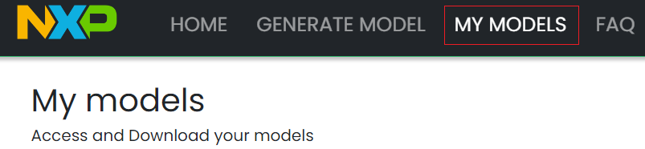

# Example 0 - Add a new command in the existing English demo

The purpose of this example is to add a new command at the end of the current supported commands for English Elevator demo: "Shut door".

For this command we will reuse the same action and prompt as we have for "Close door" command.

The patch ex0_vit.patch [can be applied](../../../README.md#applying-patches) to obtain the end-result of this example.

## Generate a new VIT model

- Navigate to this URL: [https://vit.nxp.com/#/home](https://vit.nxp.com/#/home)
- Login with your nxp.com account
- Go to "Generate model"
- Make sure to select the 2.16 SDK version


- Delete all current voice commands and add these ones:
    - first floor
    - second floor
    - third floor
    - fourth floor
    - fifth floor
    - main lobby
    - ground floor
    - basement floor
    - open door
    - close door
    - change demo
    - change language
    - elevator
    - washing machine
    - smart home
    - english
    - french
    - german
    - chinese
    - shut door

- Click on "Generate model"


- After the model is built (give it some time), it will be available in "My models"



- You can download it using the download button
- Unzipping it will result in the files below being populated. We need only the .h file for this example
- Rename the header to VIT_Model_en_Elevator.h (for this exercise we are adding a new command in the elevator demo)


## Import a new instance of the project

- Make sure you have the correct version of SDK (2.16.0). In case you don't, please follow the instructions from the main README on [how to download and install it](../../../README.md#download-mimxrt1060-evkc-v2.16.0-sdk)

- With MCUXpresso IDE open, click on "Quickstart Panel" -> "Import projects from file system"


- Browse to where the repo was cloned and select `sln_svui_iot_local_demo` folder
- Press "Next", then leave the default options selected and press on "Finish"


- For avoiding conflicts with next customization examples, rename the project to **sln_svui_iot_local_demo_vit_ex_0** (either Right click on project -> Rename or press F2 and rename window will open)

## Add the latest VIT lib

- Make sure the latest lib used for VIT is integrated in the current project, that is "VIT_CM7_v04_10_00"
- Unzip the MIMXRT1060-EVKC v2.16.0 SDK downloaded previously -> middleware -> vit -> CortexM7 -> Lib
- Add "libVIT_CM7_v04_10_00.a" from SDK to path: "sln_svui_iot_local_demo_vit_ex_0/libs"
- Replace "Inc" folder from path: "sln_svui_iot_local_demo_vit_ex_0/audio/VIT/Inc" with the one from the SDK
- Replace "VIT.h" file from path: "sln_svui_iot_local_demo_vit_ex_0/audio/VIT/VIT.h" with the one from the SDK 
- Right click on the `sln_svui_iot_local_demo_vit_ex_0` project, select Properties -> C/C++ Build -> Settings -> MCU Linker -> Libraries
- Replace the default "VIT_CM7_Production_v06_03_01" entry with "VIT_CM7_v04_10_00"
- You should have something that looks like this:


- Click on "Apply and Close" to save

## Integrate the VIT model in sln_svui_iot_local_demo

- Overwrite the elevator model from local_voice -> VIT -> en with the newly generated one
- Models are usually given the same name: VIT_Model_en / VIT_Model_fr, etc., depending on the language. If multiple models for the same language will be integrated, it will be needed to change the array name and `#ifndef` guards to something unique, like shown below:


- Update **_local_voice/VIT/en/en_strings_vit.h_**:
    - This file contains strings associated with the commands from the model
    - We will need to add a new entry for the new command
```c
const char * const cmd_elevator_en[] = {
    "First floor",
    "Second floor",
    "Third floor",
    "Fourth floor",
    "Fifth floor",
    "Main lobby",
    "Ground floor",
    "Basement floor",
    "Open door",
    "Close door",
    "Change demo",
    "Change language",
    "Elevator",
    "Washing Machine",
    "Smart Home",
    "English",
    "French",
    "German",
    "Chinese",
    "Shut door",
};
```

- Update **_local_voice/VIT/en/en_strings_to_actions_vit.h_**:
    - This is basically an association between VIT commands entries and actions from demo_actions_dsmt.h
    - We could have one action for synonym commands
    - We will reuse CloseDoor action for the new "Shut door" command
```c
const int16_t actions_elevator_en[] = {
    kElevator_FirstFloor,     // "First floor"
    kElevator_SecondFloor,    // "Second floor"
    kElevator_ThirdFloor,     // "Third floor"
    kElevator_FourthFloor,    // "Fourth floor"
    kElevator_FifthFloor,     // "Fifth floor"
    kElevator_MainLobby,      // "Main lobby"
    kElevator_GroundFloor,    // "Ground floor"
    kElevator_BasementFloor,  // "Basement floor"
    kElevator_OpenDoor,       // "Open door"
    kElevator_CloseDoor,      // "Close door"
    kElevator_ChangeDemo,     // "Change demo"
    kElevator_ChangeLanguage, // "Change language"
    kElevator_Elevator,       // "Elevator"
    kElevator_WashingMachine, // "Washing Machine"
    kElevator_SmartHome,      // "Smart Home"
    kElevator_English,        // "English"
    kElevator_French,         // "French"
    kElevator_German,         // "German"
    kElevator_Chinese,        // "Chinese"
    kElevator_CloseDoor,      // "Shut door"
}
```


- Update **_local_voice/VIT/en/en_strings_to_prompts_vit.h_**:
    - If no prompts are required, entries can be set to NULL
    - In this integration, we are reusing the CLOSE_DOOR prompt when the new command is detected
    - Integrating new prompts will be shown in a separate section
    - You can now compile and flash the new project
```c
const char * const prompts_elevator_en[] = {
    AUDIO_FIRST_FLOOR_EN,    // "First floor"
    AUDIO_SECOND_FLOOR_EN,   // "Second floor"
    AUDIO_THIRD_FLOOR_EN,    // "Third floor"
    AUDIO_FOURTH_FLOOR_EN,   // "Fourth floor"
    AUDIO_FIFTH_FLOOR_EN,    // "Fifth floor"
    AUDIO_MAIN_LOBBY_EN,     // "Main lobby"
    AUDIO_GROUND_FLOOR_EN,   // "Ground floor"
    AUDIO_BASEMENT_FLOOR_EN, // "Basement floor"
    AUDIO_OPEN_DOOR_EN,      // "Open door"
    AUDIO_CLOSE_DOOR_EN,     // "Close door"
    AUDIO_DEMO_NAME_TEST_EN, // "Change demo"
    AUDIO_LANGUAGE_TEST_EN,  // "Change language"
    AUDIO_OK_EN,             // "Elevator"
    AUDIO_OK_EN,             // "Washing Machine"
    AUDIO_OK_EN,             // "Smart Home"
    AUDIO_OK_EN,             // "English"
    AUDIO_OK_EN,             // "French"
    AUDIO_OK_EN,             // "German"
    AUDIO_OK_EN,             // "Chinese"
    AUDIO_CLOSE_DOOR_EN,     // "Shut door"
}
```

## Updating app version

It's always a good idea to update application version when planning to update via [MSD](../../../README.md#msd-update) because it will be an easy way to check if the binary got updated, by calling command `version` in the shell.

The binary version definitions are found in **_source/app.h_**.
```c
/* Application version */
#define APP_MAJ_VER                    0x02
#define APP_MIN_VER                    0x00
#define APP_BLD_VER                    0x0001
```

## Test the new project

- In the shell, type `version` and check that the output is the expected one
- Type `commands` and check that what was added new to this demo is there in the output
- Say the wake word (Hey, NXP), then the newly added command, and check if the detection happens


