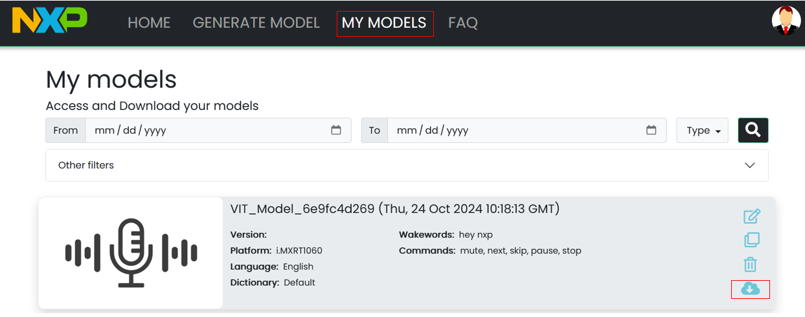
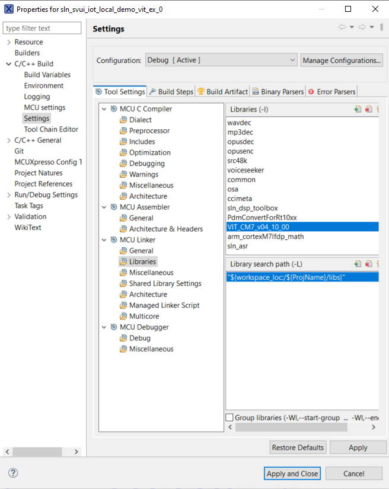

# Example 1 - Add a new EN model

In this example we will remove all existing VIT models, for all languages, and we will add a new VIT English model.

## Generate a new VIT model

- Navigate to this URL: [https://vit.nxp.com/#/home](https://vit.nxp.com/#/home)
- Login with your nxp.com account
- Go to "Generate model"
- Choose "Voice commands"


- Make sure to select the 2.16 SDK version


- Keep the default wake word, delete all pre-configured commands, except these ones:
    - mute
    - next
    - skip
    - pause
    - stop
- Click on "Generate model"


- Click on "Download model"


- The download will start automatically

- After the model is built (give it some time), it will also be available in "My models".

- You can download it using the highlighted button.



- Unzipping it will result in the files below being populated. We need only the .h file for this example


## Import a new instance of the project

- Make sure you have the correct version of SDK (2.16.0). In case you don't, please follow the instructions from the main README on [how to download and install it](../../../README.md#download-mimxrt1060-evkc-v2.16.0-sdk)

- Open MCUXpresso IDE, then click on "Quickstart Panel" -> "Import projects from file system"


- Browse to where the repo was cloned and select `sln_svui_iot_local_demo` folder
- Press "Next", then leave the default options selected and press on "Finish"


- For avoiding conflicts with next examples, rename the project to **sln_svui_iot_local_demo_vit_ex_1** (either Right click on project -> Rename or press F2 and rename window will open)

## Add the latest VIT lib

- Make sure the latest lib used for VIT is integrated in the current project, that is "VIT_CM7_v04_10_00"
- Unzip the MIMXRT1060-EVKC v2.16.0 SDK downloaded previously -> middleware -> vit -> CortexM7 -> Lib
- Add "libVIT_CM7_v04_10_00.a" from SDK to path: "sln_svui_iot_local_demo_vit_ex_1/libs"
- Replace "Inc" folder from path: "sln_svui_iot_local_demo_vit_ex_1/audio/VIT/Inc" with the one from the SDK
- Replace "VIT.h" file from path: "sln_svui_iot_local_demo_vit_ex_1/audio/VIT/VIT.h" with the one from the SDK 
- Right click on the `sln_svui_iot_local_demo_vit_ex_1` project, select Properties -> C/C++ Build -> Settings -> MCU Linker -> Libraries
- Replace the default "VIT_CM7_Production_v06_03_01" entry with "VIT_CM7_v04_10_00"
- You should have something that looks like this:



- Click on "Apply and Close" to save

## Integrate the VIT model in sln_svui_iot_local_demo

1. Copy-paste the new header model in **_local_voice/VIT/en_**
2. The models for Elevator, SmartHome and WashingMachine demos will be deleted
3. To clean up the **_local_voice/VIT_** folder, delete folders for other languages: cn, de, fr


4. Update **_source/app.h_**:
    - Set `ENABLE_NXP_OOBE` to `0`
    - We have an app layer API that can be customized for the desired user experience
    - By setting this definition to 0, we disable the NXP implementation and activate the stub API that the user can later on customize

    ```c
    /* Enable NXP out of the box experience. If set to 0,
    * no demo change or language change available through voice commands,
    * but these actions will still be possible through shell commands. */
    #define ENABLE_NXP_OOBE 0
    ```
    - Set `ENABLE_VIT` to `1`.

    ```c
    /* Choose the ASR engine: DSMT, VIT or S2I */
    #define ENABLE_DSMT_ASR                0
    #define ENABLE_VIT_ASR                 1
    #define ENABLE_S2I_ASR                 0
    ```

5. Update **_local_voice/VIT/demo_definitions_vit.h_**:

    - Update `asr_language_t` so that we have an entry only for English language.
    ```c
    /* Enumeration of the languages supported by the project
    * Add, remove or replace languages here, but keep the one bit
    * per language allocation, as currently implemented.
    * The code assumes one bit allocation per definition */
    typedef enum _asr_languages
    {
        UNDEFINED_LANGUAGE = 0,
        ASR_FIRST_LANGUAGE = (1U << 0U),
        ASR_ENGLISH = (1U << 0U),
        ASR_ALL_LANG = (ASR_ENGLISH)
    } asr_language_t;
    ```

    - Add a demo entry in `asr_inference_t`. The previous entries for OOBE demos can all be removed.
    ```c
    /* Enumeration of the command sets integrated into the project
    * Add, remove or replace the command sets here.
    * Keep the one bit per command set allocation, as currently implemented.
    * The code assumes one bit allocation per definition */
    typedef enum _asr_inference
    {
        UNDEFINED_INFERENCE = 0,
        ASR_WW = (1U << 0U),
        ASR_CMD_TEST_DEMO = (1U << 1U),
    } asr_inference_t;
    ```

    - Set `BOOT_ASR_CMD_DEMO` and `DEFAULT_ASR_CMD_DEMO` to `ASR_CMD_TEST_DEMO`.
    ```c
    /* demo after first boot. can be used for selecting the demo at the very first board boot */
    #define BOOT_ASR_CMD_DEMO ASR_CMD_TEST_DEMO

    /* default demo. this can have the same value as BOOT_ASR_CMD_DEMO
    * in our POC we use BOOT_ASR_CMD_DEMO to give the possibility to the user to select the demo
    * via voice commands. If a selection is not made until the timeout is hit, then
    * DEFAULT_ASR_CMD_DEMO will be loaded */
    #define DEFAULT_ASR_CMD_DEMO ASR_CMD_TEST_DEMO
    ```

    - Update the shell printing-related strings.
    ```c
    /* Strings used for shell printing or shell commands */
    #define LANG_STR_EN "en"

    #define DEMO_STR_TEST_DEMO "test"

    #define SHELL_SELECTABLE_DEMOS DEMO_STR_TEST_DEMO
    #define SHELL_SELECTABLE_LANGUAGES LANG_STR_EN
    ```

6. Update **_local_voice/VIT/demo_actions_vit.h_** with actions for the new demo:
    - For a cleaner integration, all enums describing current OOBE demos were removed, and only the two enums shown below are needed
    - The purpose of this structure is to list all actions that the system should make
    - Later on, an action can be associated with one or with multiple voice commands
    ```c
    #if ENABLE_VIT_ASR

    /* Global actions for all languages */

    enum _wake_word_action
    {
        kWakeWord_Detected = 0,
        kWakeWord_ActionInvalid
    };

    enum _test_demo_action
    {
        kTestDemo_Mute = 0,
        kTestDemo_Next,
        kTestDemo_Skip,
        kTestDemo_Pause,
        kTestDemo_Stop,
        kTestDemo_Invalid
    };

    #endif /* ENABLE_VIT_ASR */
    ```

7. Update **_local_voice/VIT/en/en_strings_vit.h_**:
    - For a cleaner integration, all strings describing current OOBE demos were removed
    - This file contains strings associated with the commands from the model
    ```c
    #if ENABLE_VIT_ASR

    /* English demos strings below */

    const char * const ww_en[] = {
        "Hey NXP",
    };

    const char * const cmd_test_demo_en[] = {
        "Mute",
        "Next",
        "Skip",
        "Pause",
        "Stop",
    };

    #endif /* ENABLE_VIT_ASR */
    ```

8. Update **_local_voice/VIT/en/en_strings_to_actions_vit.h_**:
    - All actions for the current OOBE demo can be deleted
    - This is basically an association between VIT commands entries and actions from demo_actions_vit.h
    - We could have one action for synonym commands, like "Mute" or "Set volume to zero"
    - For this example we have a different action for each command
    ```c
    #if ENABLE_VIT_ASR

    #include "demo_actions_vit.h"
    #include "stdint.h"

    const int16_t actions_ww_en[] = {
        kWakeWord_Detected, // "Hey NXP"
    };

    const int16_t actions_test_demo_en[] = {
        kTestDemo_Mute,  // "Mute"
        kTestDemo_Next,  // "Next"
        kTestDemo_Skip,  // "Skip"
        kTestDemo_Pause, // "Pause"
        kTestDemo_Stop,  // "Stop"
    };

    #endif /* ENABLE_VIT_ASR */
    ```

9. Update **_local_voice/VIT/en/en_strings_to_prompts_vit.h_**:
    - If no prompts are required, entries can be set to NULL
    - In this integration, we are reusing the OK prompt when one of the new commands is detected
    - Integrating new prompts will be shown in a separate section
    ```c
    #if ENABLE_VIT_ASR

    #include "sln_flash_files.h"

    const void * const prompts_ww_en[] = {
        AUDIO_WW_DETECTED, // "Hey NXP"
    };

    const void * const prompts_test_demo_en[] = {
        AUDIO_OK_EN, // "Mute"
        AUDIO_OK_EN, // "Next"
        AUDIO_OK_EN, // "Skip"
        AUDIO_OK_EN, // "Pause"
        AUDIO_OK_EN, // "Stop"
    };

    #endif /* ENABLE_VIT_ASR */
    ```

10. Update **_local_voice/VIT/en/en_voice_demos_vit.h_**:
    - All demo structures for the current OOBE demo can be deleted
    - This file is used to define demo structure
    - All previous demo definitions can be deleted
    - Also, the `#include` for previous model headers should be deleted, and new #include for the current model header should be added
    - Please note that here we are reusing lots of the structures created or modified before
    ```c
    #if ENABLE_VIT_ASR

    #include "sln_voice_demo.h"
    #include "en_strings_vit.h"
    #include "en_strings_to_actions_vit.h"
    #include "en_strings_to_prompts_vit.h"
    #include "demo_definitions_vit.h"
    #include "stddef.h"

    #include "PL_platformTypes_CortexM.h"
    #include "VIT_Model_en.h"

    const sln_voice_demo_t test_demo_en =
    {
        ww_en,                          // wake word strings
        cmd_test_demo_en,               // command strings
        actions_ww_en,                  // wake word actions
        actions_test_demo_en,           // command actions
        prompts_ww_en,                  // wake word prompts
        prompts_test_demo_en,           // command prompts
        NULL,                           // prompt for demo announcement
        NUM_ELEMENTS(ww_en),            // number of wake words
        NUM_ELEMENTS(cmd_test_demo_en), // number of commands
        (void *)VIT_Model_en,           // pointer to model
        ASR_ENGLISH,                    // what language is used
        ASR_CMD_TEST_DEMO,              // what demo is used
        LANG_STR_EN,                    // language string
        DEMO_STR_TEST_DEMO,             // demo string
    };

    #endif /* ENABLE_VIT_ASR */
    ```

11. Update **_local_voice/VIT/voice_demos_vit.c_**:
    - Delete the `#include` for other languages and keep only English
    - Delete all previous demo structure references and add the new one
    ```c
    #if ENABLE_VIT_ASR

    #include "demo_definitions_vit.h"
    #include "sln_voice_demo.h"

    #include "en_voice_demos_vit.h"

    sln_voice_demo_t const * const all_voice_demos_vit[] = {
        &test_demo_en,
        NULL // end with NULL to signal list ending
    };

    #endif /* ENABLE_VIT_ASR */
    ```

## Updating app version

It is always a good idea to update application version when planning to update via [MSD](../../../README.md#msd-update) because it will be an easy way to check if the binary got updated, by calling command `version` in the shell.

The binary version definitions are found in **_source/app.h_**.
```c
/* Application version */
#define APP_MAJ_VER 0x02
#define APP_MIN_VER 0x00
#define APP_BLD_VER 0x0002
```

## Test the new project

- Project compilation should now be successful
- Generate the binary and use it for an MSD update
- Command `version` should print 2.0.2
- Command `commands` should list the newly added commands
- Say the wake word followed by one of the commands to test the detection

