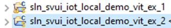
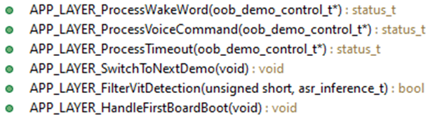
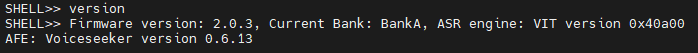

# Example 2 - Modify App Layer API to control LED after command detection

The purpose of this example is to customize the taken action when a specific command is detected.

Additionally, we will light the LED to a different color for each command.

The patch ex2_vit.patch [can be applied](../../../README.md#applying-patches) to obtain the end-result of this example.

## Start from the content of VIT example 1

- Right click on sln_svui_iot_local_demo_vit_ex_1, then click on "Copy"
- Right click in the workspace, then click on "Paste"
- You will be asked to give a name to the copied instance. Use **sln_svui_iot_local_demo_vit_ex_2**



- Make sure you have the correct version of SDK (2.16.0). In case you don't, please follow the instructions from the main README on [how to download and install it](../../../README.md#download-mimxrt1060-evkc-v2.16.0-sdk)
- You should have the latest VIT lib integrated (VIT_CM7_v04_10_00). In case you don't, please follow the instructions from VIT [example 0](../example_0/README.md#add-the-latest-vit-lib)

## App layer API

This is the API that can be customized by the user for various system events (wake word detected, voice command detected, timeout while waiting for commands, etc.)

It is declared in **_source/app_layer.h_** and defined in **_source/app_layer.c_**.

For this example, we will add new LED actions based on what command is detected, by adding new code in function `APP_LAYER_ProcessVoiceCommand`.



## Add demo actions include in app layer file

- In order to have the code know about the demo actions, we must first include the header **"demo_actions.h"** in **_source/app_layer.c_**
```c
#include "stdint.h"
#include "audio_samples.h"
#include "fsl_common.h"
#include "FreeRTOSConfig.h"
#include "sln_amplifier.h"
#include "sln_local_voice_common.h"
#include "sln_rgb_led_driver.h"
#include "local_sounds_task.h"
#include "sln_flash_files.h"

#include "IndexCommands.h"

#include "demo_actions.h"
```

## Write code to handle command detection

- Right after the prompts playback in `APP_LAYER_ProcessVoiceCommand`, get the action associated with the keyword id
- Then assign a different LED color depending on the action id
- Light the LED to the specified color for two seconds, then turn it off
- Also comment the previous LED handling code to have only the new one active
```c
__attribute__ ((weak)) status_t APP_LAYER_ProcessVoiceCommand(oob_demo_control_t *commandConfig)
{
    status_t status = kStatus_Success;

#if ENABLE_STREAMER
    char *prompt = NULL;
    if (commandConfig != NULL)
    {
        /* Play prompt for the active language */
        prompt = get_prompt_from_keyword(commandConfig->language, commandConfig->commandSet, commandConfig->commandId);

        if (NULL != prompt)
        {
            APP_LAYER_PlayAudioFromFileSystem(prompt);
        }
        
        /* Get the action associated with the command */
        uint16_t action = get_action_from_keyword(commandConfig->language,
                                                  commandConfig->commandSet,
                                                  commandConfig->commandId);
        rgbLedColor_t action_color = LED_COLOR_OFF;

        /* Light the LED for 2 seconds with a dedicated color for each action */
        switch (action) {
            case kTestDemo_Mute: {
                action_color = LED_COLOR_RED;
                break;
            }
            case kTestDemo_Next: {
                action_color = LED_COLOR_ORANGE;
                break;
            }
            case kTestDemo_Skip: {
                action_color = LED_COLOR_YELLOW;
                break;
            }
            case kTestDemo_Pause: {
                action_color = LED_COLOR_PURPLE;
                break;
            }
            case kTestDemo_Stop: {
                action_color = LED_COLOR_WHITE;
                break;
            }
        }

        RGB_LED_SetColor(LED_COLOR_OFF);
        RGB_LED_SetColor(action_color);
        vTaskDelay(2000);
        RGB_LED_SetColor(LED_COLOR_OFF);
    }
#endif /* ENABLE_STREAMER */

//    if (status == kStatus_Success)
//    {
//        APP_LAYER_LedCommandDetected();
//    }
//    else
//    {
//        APP_LAYER_LedError();
//    }

    return status;
}
```

## Updating app version

It's always a good idea to update application version when planning to update via [MSD](../../../README.md#msd-update) because it will be an easy way to check if the binary got updated, by calling command "version" in the shell.

The binary version definitions are found in **_source/app.h_**.
```c
/* Application version */
#define APP_MAJ_VER 0x02
#define APP_MIN_VER 0x00
#define APP_BLD_VER 0x0003
```

## Test the new project

Project compilation should now be successful.

- Generate the binary and use it for an MSD update
- Command `version` should print 2.0.3
- Say the wake word followed by one of the commands to test the detection, then check the LED behavior

