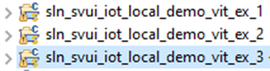
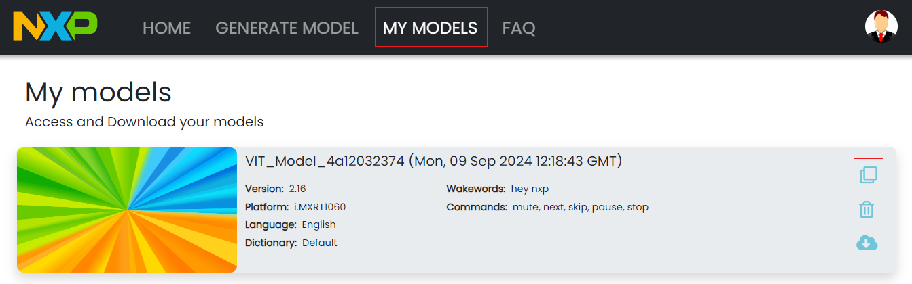
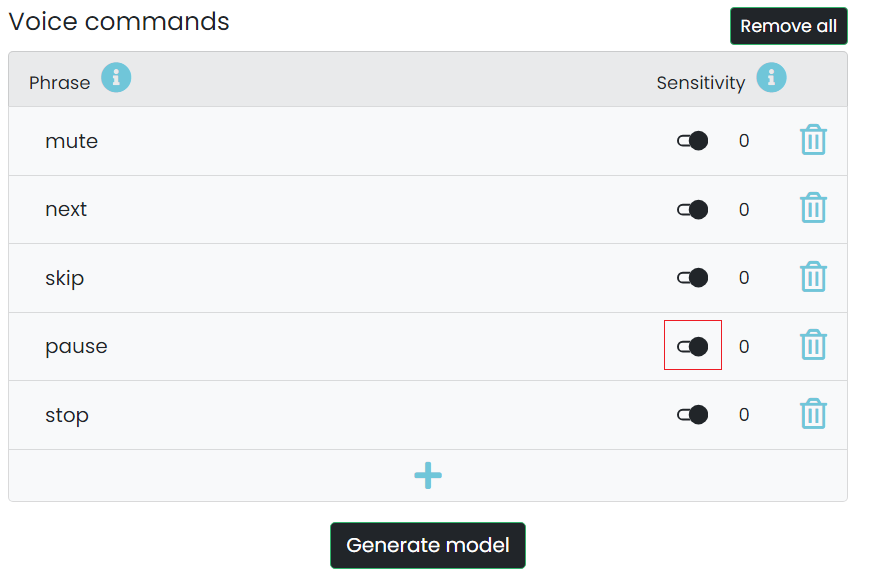
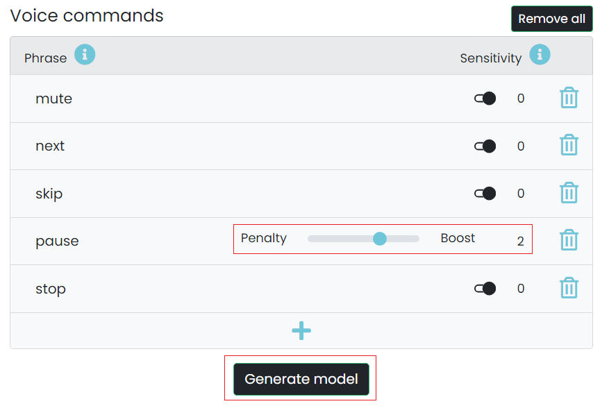
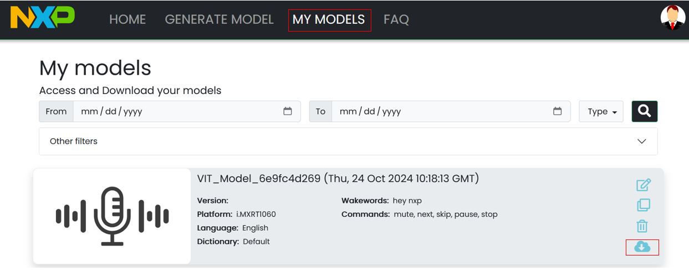
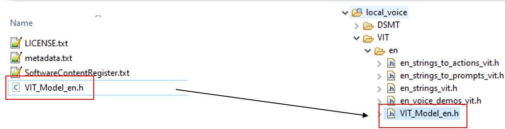

# Example 3 - Test and tune a VIT model

The purpose of this example is to tune an English VIT model.

The patch ex3_vit.patch [can be applied](../../../README.md#applying-patches) to obtain the end-result of this example.

## Start from the content of VIT example 2

- Right click on sln_svui_iot_local_demo_vit_ex_2, then click on "Copy"
- Right click in the workspace, then click on "Paste"
- You will be asked to give a name to the copied instance. Use **sln_svui_iot_local_demo_vit_ex_3**

- Make sure you have the correct version of SDK (2.16.0). In case you don't, please follow the instructions from the main README on [how to download and install it](../../../README.md#download-mimxrt1060-evkc-v2.16.0-sdk)
- You should have the latest VIT lib integrated (VIT_CM7_v04_10_00). In case you don't, please follow the instructions from VIT [example 0](../example_0/README.md#add-the-latest-vit-lib)

## Clone previous VIT model settings

- Go to "My models" tab and locate the model we used for [VIT example 1](../example_1/README.md)
- You can open that model and edit its settings by pressing the "Clone" button

## Modifying command sensitivity

What is the usage of the sensitivity parameter for the wakewords and voice commands?

Sensitivity parameter helps to improve recognition of the keywords (either wakewords or voice commands).

A positive value of sensitivity is corresponding to a boost on the keyword : applying a boost is increasing the recognition rate. A negative value of sensitivity is corresponding to a penalty on the keyword : applying a penalty is helping to solve false detection on a keyword or confusion between keywords (see penalty parameter section below).

Let's make the "Pause" command trigger easier by increasing its boost to value 2 by pressing the edit sensitivity button, then moving the slider to the right.

Use "Generate model" to generate a new model and download it after it is ready.

## Download the new model and integrate it

- After the model is built, it will be available in "My models"
- You can download it using the download button

- Unzipping it will result in the files below being populated
- Overwrite **VIT_Model_en.h** from your project and rebuild
- Use the new binary for [MSD](../../../README.md#msd-update)
- "Pause" command should now trigger easier than before, but this will likely affect the false positive rate as well

