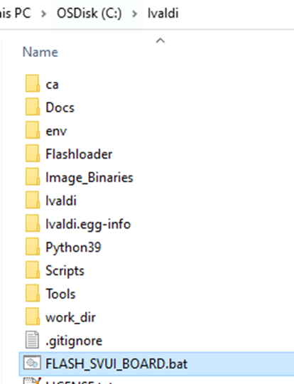
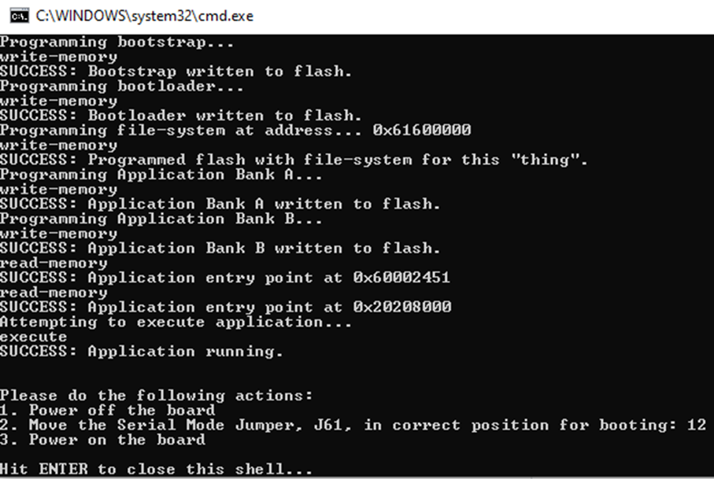

# Example 4 - Add new audio prompts

The purpose of this example is to add new audio prompts associated with the commands recognition.

The patch ex4_vit.patch [can be applied](../../../README.md#applying-patches) to obtain the end-result of this example.

> [!NOTE]
> Applying the patch will not modify the file system!
> You will still need to run Ivaldi and populate the .opus files at the path described later in this section.

## Start from the content of VIT example 3

- Right click on sln_svui_iot_local_demo_vit_ex_3, then click on "Copy"
- Right click in the workspace, then click on "Paste"
- You will be asked to give a name to the copied instance. Use **sln_svui_iot_local_demo_vit_ex_4**


- Make sure you have the correct version of SDK (2.16.0). In case you don't, please follow the instructions from the main README on [how to download and install it](../../../README.md#download-mimxrt1060-evkc-v2.16.0-sdk)
- You should have the latest VIT lib integrated (VIT_CM7_v04_10_00). In case you don't, please follow the instructions from VIT [example 0](../example_0/README.md#add-the-latest-vit-lib)

## Generating mp3 files

In order to add new audio prompts, .mp3 files need to be generated first.

There are multiple free text-to-speech tools available on the internet.

For this training, mp3 files were generated using [ttsmp3.com](https://ttsmp3.com/).

It is an easy to use free online text-to-speech tool that provides up to 50 different languages and accents.


## Convert files to opus

Starting from the .mp3 files, we have to convert them into .opus format.

**Opus** is a lossy audio coding format designed to efficiently code speech and general audio in a single format while remaining low-complexity enough for low-end embedded processors.

To convert mp3 files to opus files, an audio format converter was created and it is available in **tools\audio_format_conversion**.

## Convert files to opus - Setup

The audio format converter is a bash script, which means it requires a Linux terminal: [How to install WSL (Windows Subsystem for Linux)](https://www.geeksforgeeks.org/how-to-install-and-run-linux-software-in-windows-10-using-wsl2/). Alternatively, you can use a Linux Virtual Machine or a Linux system.

The following packages would need to be installed by running these commands:
```
sudo apt-get install -y libopus-dev
sudo apt install ffmpeg
sudo dos2unix convert.sh
```


## Generating all mp3 files for this exercise

- On ttsmp3.com select an English voice and generate mp3 files using the text below: 
    - "Ok, mute" -> ok_mute.mp3
    - "Ok, next" -> ok_next.mp3
    - "Ok, pause" -> ok_pause.mp3
    - "Ok, skip" -> ok_skip.mp3
    - "Ok, stop" -> ok_stop.mp3
    - "New prompts exercise demo" -> new_prompts_demo.mp3
- Save the files in a folder structure like the one below, in folder "tools\audio_format_conversion"

> [!NOTE]
> With current scripts, it is mandatory to have this folder structure: **audio_format_conversion\project_name\language_name**


## Convert files to opus

- Open a linux terminal in folder "tools\audio_format_conversion" an run `./convert.sh opus bin 16000` (arguments explained in README)

- Might need to run `dos2unix convert.sh` when encountering the following errors:
```
./convert.sh: line 7: $'\r': command not found
./convert.sh: line 9: $'\r': command not found
./convert.sh: line 11: $'\r': command not found
./convert.sh: line 13: syntax error in conditional expression
'/convert.sh: line 13: syntax error near `]]
'/convert.sh: line 13: ` if [[ ${f::1} == "/" ]]
```


- This will result in .opus files being populated  next to .mp3 files


## Copy the files in Ivaldi source tree

- Copy the entire "prompts_exercise" folder in **\Ivaldi_updater\Image_Binaries\svui_audio_files**
- While in folder « EN », search for .mp3 files. Select all results, then delete them
- You should have only .opus files in the folder in the end


## Generate a new files header

We need to generate a new files header for littlefs.

- First open cmd, then go to **tools\Ivaldi_updater**
- Activate the env with `env\Scripts\activate`
- Run `cd Scripts\sln_platforms_config\sln_svui_iot_config`
- Then run `python generate_lfs_files_header.py`

> [!NOTE]
> **Ivaldi_updater\FLASH_SVUI_BOARD.bat** must have been run at least once before, in order for it to properly set pyenv.conf to point to the Python installation from the pre-configured package.

This command will generate a .h header file with defines for all files that will be a part of the file system.


- We will edit the file and copy the section of interest for us


- In the MCUXpresso project, edit **_source/sln_flash_files.h_** and add the newly generated lines at the end of it
```c
#define AUDIO_DELICATE_FR                                        "Washing_Machine/FR/01_delicate_fr.opus"
#define AUDIO_NORMAL_FR                                          "Washing_Machine/FR/02_normal_fr.opus"
#define AUDIO_HEAVY_DUTY_FR                                      "Washing_Machine/FR/03_heavy_duty_fr.opus"
#define AUDIO_WHITES_FR                                          "Washing_Machine/FR/04_whites_fr.opus"
#define AUDIO_START_FR                                           "Washing_Machine/FR/05_start_fr.opus"
#define AUDIO_CANCEL_FR                                          "Washing_Machine/FR/06_cancel_fr.opus"

// New prompts definitions starting below
#define AUDIO_NEW_PROMPTS_DEMO                                   "prompts_exercise/EN/new_prompts_demo.opus"
#define AUDIO_OK_MUTE                                            "prompts_exercise/EN/ok_mute.opus"
#define AUDIO_OK_NEXT                                            "prompts_exercise/EN/ok_next.opus"
#define AUDIO_OK_PAUSE                                           "prompts_exercise/EN/ok_pause.opus"
#define AUDIO_OK_SKIP                                            "prompts_exercise/EN/ok_skip.opus"
#define AUDIO_OK_STOP                                            "prompts_exercise/EN/ok_stop.opus"

#endif /* _SLN_FLASH_FILES_H_ */
```

## Integrate the new prompts in the source code

- Edit **_local_voice/VIT/en/en_strings_to_prompts_vit.h_** to point to the new prompts
```c
#if ENABLE_VIT_ASR

#include "sln_flash_files.h"

const void * const prompts_ww_en[] = {
    AUDIO_WW_DETECTED, // "Hey NXP"
};

const void * const prompts_test_demo_en[] = {
    AUDIO_OK_MUTE,  // "Mute"
    AUDIO_OK_NEXT,  // "Next"
    AUDIO_OK_SKIP,  // "Skip"
    AUDIO_OK_PAUSE, // "Pause"
    AUDIO_OK_STOP,  // "Stop"
};

#endif /* ENABLE_VIT_ASR */
```
- Edit **_local_voice/VIT/en/en_voice_demos_vit.h_** to play the demo announcement prompt: add **AUDIO_NEW_PROMPTS_DEMO** instead of NULL
```c
const sln_voice_demo_t test_demo_en =
{
    ww_en,                          // wake word strings
    cmd_test_demo_en,               // command strings
    actions_ww_en,                  // wake word actions
    actions_test_demo_en,           // command actions
    prompts_ww_en,                  // wake word prompts
    prompts_test_demo_en,           // command prompts
    AUDIO_NEW_PROMPTS_DEMO,         // prompt for demo announcement
    NUM_ELEMENTS(ww_en),            // number of wake words
    NUM_ELEMENTS(cmd_test_demo_en), // number of commands
    (void *)VIT_Model_en,           // pointer to model
    ASR_ENGLISH,                    // what language is used
    ASR_CMD_TEST_DEMO,              // what demo is used
    LANG_STR_EN,                    // language string
    DEMO_STR_TEST_DEMO,             // demo string
};
```

## Updating app version

It is always a good idea to update application version when planning to update via [MSD](../../../README.md#msd-update) because it will be an easy way to check if the binary got updated, by calling command `version` in the shell.

The binary version definitions are found in **_source/app.h_**.

```c
/* Application version */
#define APP_MAJ_VER 0x02
#define APP_MIN_VER 0x00
#define APP_BLD_VER 0x0004
```

## Deploy the new binaries

- Build the project in MCUXpresso, then generate a .bin from the .axf
- Rename the .bin to **sln_svui_iot_local_demo_vit.bin** and overwrite the existing one in **Ivaldi_updater\Image_Binaries**
- Ensure the board is in **serial downloader mode** by moving jumper **J61** to connect **pins 2 and 3** (towards the buttons)
- Then run **FLASH_SVUI_BOARD.bat**:
    - This will generate a new sln_svui_iot_file_system.bin image and flash it
    - It will also flash sln_svui_iot_bootloader.bin, sln_svui_iot_bootstrap.bin, and sln_svui_iot_local_demo_vit.bin





## Test the new project

- Generate the binary and use it for an MSD update
- Command `version` should print 2.0.4
- Command `commands` should list the newly added commands
- Say the wake word followed by one of the commands to test the detection
- You should now hear the new promts being played

