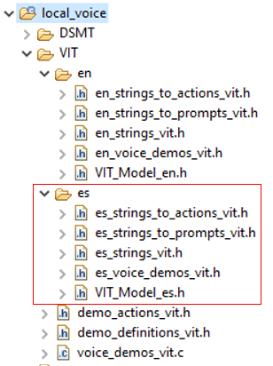

# Example 5 - Add a new ES model

The purpose of this example is to add a Spanish model next to the existing English one.

Both models will use the same demo actions and prompts.

The patch ex5_vit.patch [can be applied](../../../README.md#applying-patches) to obtain the end-result of this example.

## Generate a new VIT model

- Navigate to this URL: [https://vit.nxp.com/#/home](https://vit.nxp.com/#/home)
- Login with your nxp.com account
- Go to "Generate model"
- Make sure to select the 2.16 SDK version


- Select Spanish language
- Keep the default wake word, delete all pre-configured commands, except the ones below
- Click on "Generate model"


- After the model is built (give it some time), it will be available in "My models"
- You can download it using the highlighted button
- Unzipping it will result in the files below being populated. We need only the .h file for this example


## Start from the content of VIT example 1

- Right click on sln_svui_iot_local_demo_vit_ex_1, then click on "Copy"
- Right click in the workspace, then click on "Paste"
- You will be asked to give a name to the copied instance. Use **sln_svui_iot_local_demo_vit_ex_5**


- Make sure you have the correct version of SDK (2.16.0). In case you don't, please follow the instructions from the main README on [how to download and install it](../../../README.md#download-mimxrt1060-evkc-v2.16.0-sdk)
- You should have the latest VIT lib integrated (VIT_CM7_v04_10_00). In case you don't, please follow the instructions from VIT [example 0](../example_0/README.md#add-the-latest-vit-lib)

## Add new folder structure for es language

- Copy all sources from en folder, then rename from en_* to es_*
- Every source will be modified later on
- Add the model header created earlier



## Integrate the VIT model in sln_svui_iot_local_demo

1. Update **_local_voice/VIT/demo_definitions_vit.h_**:
    - Update `asr_language_t` so that it knows about Spanish language as well.
    ```c
    /* Enumeration of the languages supported by the project
    * Add, remove or replace languages here, but keep the one bit
    * per language allocation, as currently implemented.
    * The code assumes one bit allocation per definition */
    typedef enum _asr_languages
    {
        UNDEFINED_LANGUAGE = 0,
        ASR_FIRST_LANGUAGE = (1U << 0U),
        ASR_ENGLISH        = (1U << 0U),
        ASR_SPANISH        = (1U << 1U),
        ASR_ALL_LANG       = (ASR_ENGLISH | ASR_SPANISH)
    } asr_language_t;
    ```

    - Update the shell printing-related strings.
    ```c
    /* Strings used for shell printing or shell commands */
    #define LANG_STR_EN "en"
    #define LANG_STR_ES "es"

    #define DEMO_STR_TEST_DEMO "test"

    #define SHELL_SELECTABLE_DEMOS DEMO_STR_TEST_DEMO
    #define SHELL_SELECTABLE_LANGUAGES LANG_STR_EN " " LANG_STR_ES
    ```

2. Update **_local_voice/VIT/es/es_strings_vit.h_**:
    - This file contains strings associated with the commands from the model.
    - Please note that you need to modify the preproc definitions as well, must change the `EN_EN` to `ES_ES`
    ```c
    #ifndef VIT_ES_ES_STRINGS_VIT_H_
    #define VIT_ES_ES_STRINGS_VIT_H_

    #if ENABLE_VIT_ASR

    /* Spanish demos strings below */

    const char * const ww_es[] = {
        "Hola NXP",
    };

    const char * const cmd_test_demo_es[] = {
        "Silencio",
        "Siguiente",
        "Salta",
        "Pausa",
        "Détente",
    };

    #endif /* ENABLE_VIT_ASR */
    #endif /* VIT_ES_ES_STRINGS_VIT_H_ */
    ```

3. Update **_local_voice/VIT/es/es_strings_to_actions_vit.h_**:
    - This is basically an association between VIT commands entries and actions from demo_actions_vit.h
    ```c
    #ifndef VIT_ES_ES_STRINGS_TO_ACTIONS_VIT_H_
    #define VIT_ES_ES_STRINGS_TO_ACTIONS_VIT_H_

    #if ENABLE_VIT_ASR

    #include "demo_actions_vit.h"
    #include "stdint.h"

    const int16_t actions_ww_es[] = {
        kWakeWord_Detected, // "Hola NXP"
    };

    const int16_t actions_test_demo_es[] = {
        kTestDemo_Mute,  // "Silencio"
        kTestDemo_Next,  // "Siguiente"
        kTestDemo_Skip,  // "Salta"
        kTestDemo_Pause, // "Pausa"
        kTestDemo_Stop,  // "Détente"
    };

    #endif /* ENABLE_VIT_ASR */
    #endif /* VIT_ES_ES_STRINGS_TO_ACTIONS_VIT_H_ */
    ```

4. Update **_local_voice/VIT/es/es_strings_to_prompts_vit.h_**:
    - If no prompts are required, entries can be set to NULL
    - In this integration, we are reusing the OK prompt when one of the new commands is detected
    ```c
    #ifndef VIT_ES_ES_STRINGS_TO_PROMPTS_VIT_H_
    #define VIT_ES_ES_STRINGS_TO_PROMPTS_VIT_H_

    #if ENABLE_VIT_ASR

    #include "sln_flash_files.h"

    const void * const prompts_ww_es[] = {
        AUDIO_WW_DETECTED, // "Hola NXP"
    };

    const void * const prompts_test_demo_es[] = {
        AUDIO_OK_EN,    // "Silencio"
        AUDIO_OK_EN,    // "Siguiente"
        AUDIO_OK_EN,    // "Salta"
        AUDIO_OK_EN,    // "Pausa"
        AUDIO_OK_EN,    // "Détente"
    };

    #endif /* ENABLE_VIT_ASR */
    #endif /* VIT_ES_ES_STRINGS_TO_PROMPTS_VIT_H_ */
    ```

5. Update **_local_voice/VIT/es/es_voice_demos_vit.h_**:
    - This file is used to define demo structure
    ```c
    #ifndef VIT_ES_ES_VOICE_DEMOS_VIT_H_
    #define VIT_ES_ES_VOICE_DEMOS_VIT_H_

    #if ENABLE_VIT_ASR

    #include "sln_voice_demo.h"
    #include "es_strings_vit.h"
    #include "es_strings_to_actions_vit.h"
    #include "es_strings_to_prompts_vit.h"
    #include "demo_definitions_vit.h"
    #include "stddef.h"

    #include "PL_platformTypes_CortexM.h"
    #include "VIT_Model_es.h"

    const sln_voice_demo_t test_demo_es =
    {
        ww_es,                          // wake word strings
        cmd_test_demo_es,               // commands strings
        actions_ww_es,                  // wake word actions
        actions_test_demo_es,           // commands actions
        prompts_ww_es,                  // wake word prompts
        prompts_test_demo_es,           // commands prompts
        NULL,                           // prompt for demo announcement
        NUM_ELEMENTS(ww_es),            // number of wake words
        NUM_ELEMENTS(cmd_test_demo_es), // number of commands
        (void *)VIT_Model_es,           // pointer to model
        ASR_SPANISH,                    // what language is used
        ASR_CMD_TEST_DEMO,              // what demo is usedo
        LANG_STR_ES,                    // language string
        DEMO_STR_TEST_DEMO,             // demo string
    };

    #endif /* ENABLE_VIT_ASR */
    #endif /* VIT_ES_ES_VOICE_DEMOS_VIT_H_ */
    ```

6. Update **_local_voice/VIT/voice_demos_vit.c_**:
    - Add a demo entry for the new Spanish demo
    ```c
    #if ENABLE_VIT_ASR

    #include "demo_definitions_vit.h"
    #include "sln_voice_demo.h"

    #include "en_voice_demos_vit.h"
    #include "es_voice_demos_vit.h"

    sln_voice_demo_t const * const all_voice_demos_vit[] = {
        &test_demo_en,
        &test_demo_es,
        NULL // end with NULL to signal list ending
    };

    #endif /* ENABLE_VIT_ASR */
    ```

## Add es folder to include paths in project settings

Otherwise you would get a compilation error saying the header is not found.


- Right click on project, select "Properties"
- Go to "C/C++ General" -> "Paths and Symbols"	
- On "Includes" tab, click on "GNU C", then on "Add"


- On the newly opened window, click on "Workspace"
- Navigate to the local_voice/VIT/es folder, click on "es" then on "OK"
- Check all checkboxes, then click "OK"


## Updating app version

It's always a good idea to update application version when planning to update via [MSD](../../../README.md#msd-update) because it will be an easy way to check if the binary got updated, by calling command `version` in the shell.

The binary version definitions are found in **_source/app.h_**.
```c
/* Application version */
#define APP_MAJ_VER                    0x02
#define APP_MIN_VER                    0x00
#define APP_BLD_VER                    0x0005
```

## Test the new project

- Project compilation should now be successful
- Generate the binary and use it for an MSD update
- Command `version` should print 2.0.5
- Command `help` should display "es" language as available to change to
- Change to es by using command `changelang es`
- Command `commands` should list the newly added commands
- Say the wake word followed by one of the commands to test the detection

 <br> </br>

