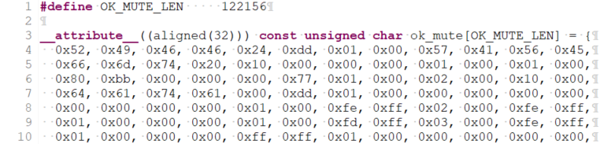
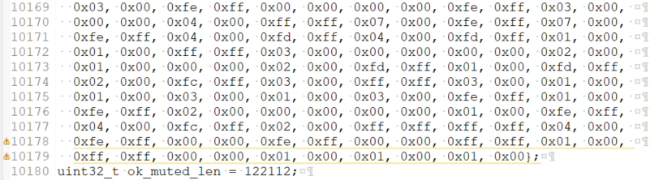
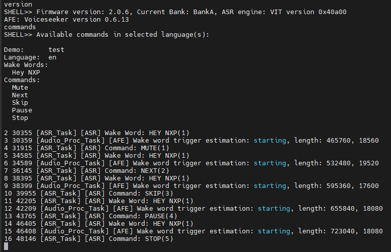

# Example 6 - Play prompts from the binary

The purpose of this example is to change the format of the prompts from .opus stored in the file system to .wav stored in the loaded binary.

## Start from the content of VIT example 1

- Right click on sln_svui_iot_local_demo_vit_ex_1, then click on "Copy"
- Right click in the workspace, then click on "Paste"
- You will be asked to give a name to the copied instance. Use **sln_svui_iot_local_demo_vit_ex_6**
- Make sure you have the correct version of SDK (2.16.0). In case you don't, please follow the instructions from the main README on [how to download and install it](../../../README.md#download-mimxrt1060-evkc-v2.16.0-sdk)
- You should have the latest VIT lib integrated (VIT_CM7_v04_10_00). In case you don't, please follow the instructions from VIT [example 0](../example_0/README.md#add-the-latest-vit-lib)

## Generating header files from .wav audio

For this example to work, the format of the .wav files must be mono with a sample rate of 48000 Hz and a signed 16-bit PCM encoding. The prompts will be stored in the binary as a const unsigned char array of hexadecimal values.
> [!NOTE]
> For the following example to work we need to also generate prompts for wake word detection and command timeout.

- Open a linux terminal in the folder in which you store the .wav prompts you want to include in the project
- Run the following command for each prompt **"xxd -i `prompt`.wav > `prompt`.h"**. Replace `prompt` with the name of each audio file

    <br/><br/>

- Copy the resulting files at the following path **/sln_svui_iot_local_demo_ex_6/audio/prompts**
- Create a macro with the length stored by the variable located at the end of header, as such for example:
```c
#define OK_MUTE_LEN     122156
```
- Modify the array type inside the header files from `unsigned char` to `__attribute__((aligned(32))) const unsigned char` with the length defined by the macro.

This is how a prompt header is supposed to look if all steps are done correctly

<br/><br/>
<br/><br/>

## Integrate the .wav prompts

1. Add binary prompt header.

    -  We will create a new header file for the .wav prompt structure, called **binary_prompts.h**, at /source.

    - After this, write the following code inside the header:

```c
#ifndef BINARY_PROMPTS_H_
#define BINARY_PROMPTS_H_

typedef struct _prompts_list
{
    void* prompt_audio;
    uint32_t prompt_audio_len;
} prompts_list_t;

#endif /* BINARY_PROMPTS_H_ */`
```
2. Update **/audio/sln_amplifier.c**
- Include "fsl_gpio.h" after all other include clauses.
```c
#include "fsl_gpio.h"
```

- Power the amplifier when calling **SLN_AMP_PlayAudioAsyncTask()**

```c
static void SLN_AMP_PlayAudioAsyncTask(void *pvParameters)
{
    status_t status                = kStatus_Success;
    sln_amp_write_packet_t *packet = NULL;

    while (1)
    {
        xQueueReceive(s_AudioNoWaitTaskQueue, &packet, portMAX_DELAY);

        if (packet == NULL)
        {
            configPRINTF(("[ERROR] SLN_AMP_PlayAudioAsyncTask received empty packet\r\n"));
            continue;
        }
        /* Turn on the amplifier before playing */
        GPIO_PinWrite(GPIO2, 2, 1);
        vTaskDelay(150U);
        status = SLN_AMP_WriteAudioPipeline(packet->data, packet->length, packet->slotSize, packet->slotCnt,
                                        packet->inFlash);
        if (status != kStatus_Success)
        {
            configPRINTF(("[ERROR] SLN_AMP_PlayAudioAsyncTask failed %d\r\n", status));
        }
        /* Turn off the amplifier after playing */
        GPIO_PinWrite(GPIO2, 2, 0);
        vPortFree(packet);
        packet = NULL;

        s_SlnAmpState = kSlnAmpIdle;
    }
}
```
3. Update **/source/app.h**
- Set `ENABLE_VIT` to `1`.

```c
/* Choose the ASR engine: DSMT, VIT or S2I */
#define ENABLE_DSMT_ASR                0
#define ENABLE_VIT_ASR                 1
#define ENABLE_S2I_ASR                 0
```
- Set `ENABLE_NXP_OOBE` to `0`

```c
/* Enable NXP out of the box experience. If set to 0,
* no demo change or language change available through voice commands,
* but these actions will still be possible through shell commands. */
#define ENABLE_NXP_OOBE                0
```
- Set `ENABLE_STREAMER` to `0`

```c
/* If set to 1, streamer task will run and it will decode OPUS encoded
* audio files, then feed raw PCM audio data to the amplifier.
* If set to 0, streamer task will not feed raw PCM audio data to the amplifier.
* Disabling the streamer saves RAM memory. */
#define ENABLE_STREAMER                0
```
4. Update **/source/app_layer.c**
- Include **fsl_gpio.h**, the **binary_prompts.h** header generated at [Step 1](#generating-header-files-from-wav-audio) and also the wake word detection and tone timeout prompt header files, created at subchapter [**Generating header files from .wav audio**](#generating-header-files-from-wav-audio)
```c
#include "fsl_gpio.h"
#include "binary_prompts.h"
#include "tone_timeout.h"
#include "ww_detected.h"
```
- Modify **APP_LAYER_ProcessWakeWord()** to change the played prompt
```c
__attribute__ ((weak)) status_t APP_LAYER_ProcessWakeWord(oob_demo_control_t *commandConfig)
{
    status_t status = kStatus_Success;
#if ENABLE_STREAMER
    APP_LAYER_PlayAudioFromFileSystem(AUDIO_WW_DETECTED);
#else
    status = SLN_AMP_WriteAudioNoWait((uint8_t*)ww_detected, WW_DETECTED_LEN, DEFAULT_AMP_SLOT_SIZE, DEFAULT_AMP_SLOT_CNT, true);
    if(status != kStatus_Success)
    {
        configPRINTF(("[Error] SLN_AMP_WriteAudioNoWait failed %d\r\n", status));
    }
#endif /* ENABLE_STREAMER */

    APP_LAYER_LedListening();

    return status;
}
```
- Update **APP_LAYER_ProcessVoiceCommand()** 
```c
__attribute__ ((weak)) status_t APP_LAYER_ProcessVoiceCommand(oob_demo_control_t *commandConfig)
{
    status_t status = kStatus_Success;
    prompts_list_t* prompt = NULL;
    if (commandConfig != NULL)
    {
        /* Play prompt for the active language */
        prompt = (prompts_list_t*)get_prompt_from_keyword(commandConfig->language, commandConfig->commandSet, commandConfig->commandId);
    }

#if ENABLE_STREAMER
    if (NULL != prompt)
    {
        APP_LAYER_PlayAudioFromFileSystem((char*)prompt);
    }
#else
    status = SLN_AMP_WriteAudioNoWait(prompt->prompt_audio, prompt->prompt_audio_len, DEFAULT_AMP_SLOT_SIZE, DEFAULT_AMP_SLOT_CNT, true);
    if(status != kStatus_Success)
    {
        configPRINTF(("[Error] SLN_AMP_WriteAudioNoWait failed %d\r\n", status));
    }
#endif /* ENABLE_STREAMER */

    if (status == kStatus_Success)
    {
        APP_LAYER_LedCommandDetected();
    }
    else
    {
        APP_LAYER_LedError();
    }

    return status;
}
#endif /* ENABLE_S2I_ASR */
```
- Modify **APP_LAYER_ProcessTimeout()** to change the played prompt
```c
__attribute__ ((weak)) status_t APP_LAYER_ProcessTimeout(oob_demo_control_t *commandConfig)
{
    status_t status = kStatus_Success;
#if ENABLE_STREAMER
    APP_LAYER_PlayAudioFromFileSystem(AUDIO_TONE_TIMEOUT);
#else
    status = SLN_AMP_WriteAudioNoWait((uint8_t*)tone_timeout, TONE_TIMEOUT_LEN, DEFAULT_AMP_SLOT_SIZE, DEFAULT_AMP_SLOT_CNT, true);
    if(status != kStatus_Success)
    {
        configPRINTF(("[Error] SLN_AMP_WriteAudioNoWait failed %d\r\n", status));
    }
#endif /* ENABLE_STREAMER */

    APP_LAYER_LedTimeout();

    return status;
}  
```
5. Update **/local_voice/VIT/en/en_strings_to_prompts_vit.h**
```c
#ifndef VIT_EN_EN_STRINGS_TO_PROMPTS_VIT_H_
#define VIT_EN_EN_STRINGS_TO_PROMPTS_VIT_H_

#if ENABLE_VIT_ASR

#include "sln_flash_files.h"
#include "binary_prompts.h"
#include "ok_mute.h"
#include "ok_next.h"
#include "ok_pause.h"
#include "ok_skip.h"
#include "ok_stop.h"

prompts_list_t const * const mute_prompt = &(prompts_list_t){(void*)ok_mute, OK_MUTE_LEN};
prompts_list_t const * const next_prompt = &(prompts_list_t){(void*)ok_next, OK_NEXT_LEN};
prompts_list_t const * const pause_prompt = &(prompts_list_t){(void*)ok_pause, OK_PAUSE_LEN};
prompts_list_t const * const skip_prompt = &(prompts_list_t){(void*)ok_skip, OK_SKIP_LEN};
prompts_list_t const * const stop_prompt = &(prompts_list_t){(void*)ok_stop, OK_STOP_LEN};

void const * const prompts_ww_en[] = {
    AUDIO_WW_DETECTED, // "Hey NXP"
};

void const * const prompts_test_demo_en[] = {
    mute_prompt,  // "Ok, muted"
    next_prompt,  // "Ok, next"
    skip_prompt,  // "Ok, skipped"
    pause_prompt, // "Ok, paused"
    stop_prompt,  // "Ok, stop"
};

#endif /* ENABLE_VIT_ASR */
#endif /* VIT_EN_EN_STRINGS_TO_PROMPTS_VIT_H_ */
```

## Updating app version

It is always a good idea to update application version when planning to update via [MSD](../../../README.md#msd-update) because it will be an easy way to check if the binary got updated, by calling command `version` in the shell.

The binary version definitions are found in **_source/app.h_**.
```c
/* Application version */
#define APP_MAJ_VER 0x02
#define APP_MIN_VER 0x00
#define APP_BLD_VER 0x0006
```

## Test the new project

- Project compilation should now be successful
- Generate the binary and use it for an MSD update
- Command `version` should print 2.0.6
- Command `commands` should list commands added at Example 1
- Say the wake word followed by one of the commands to test the detection

<br/><br/>