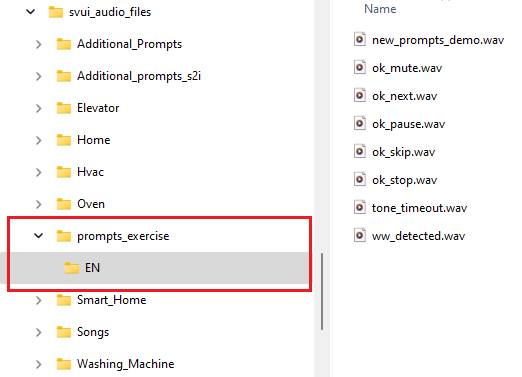
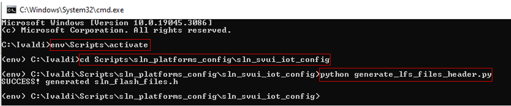
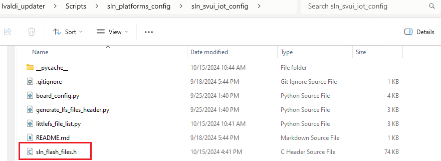
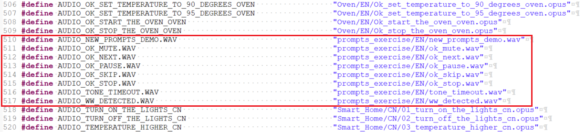
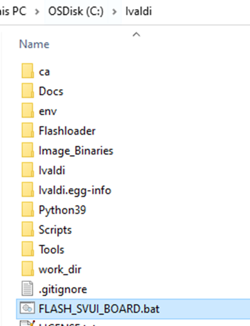
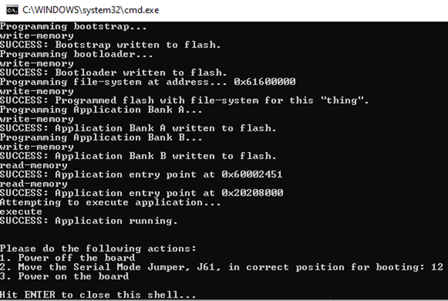
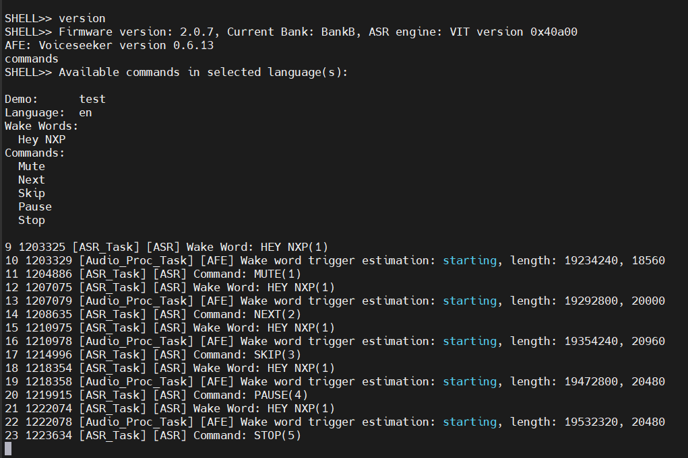

# Example 7 - Play .wav prompts from the file system

The purpose of this example is to play .wav prompts from the file system 

## Start from the content of VIT example 1

- Right click on sln_svui_iot_local_demo_vit_ex_1, then click on "Copy"
- Right click in the workspace, then click on "Paste"
- You will be asked to give a name to the copied instance. Use **sln_svui_iot_local_demo_vit_ex_7**
- Make sure you have the correct version of SDK (2.16.0). In case you don't, please follow the instructions from the main README on [how to download and install it](../../../README.md#download-mimxrt1060-evkc-v2.16.0-sdk)
- You should have the latest VIT lib integrated (VIT_CM7_v04_10_00). In case you don't, please follow the instructions from VIT [example 0](../example_0/README.md#add-the-latest-vit-lib)

## Add prompts to the file system

For this example to work, the format of the .wav files must be mono with a sample rate of 48000 Hz and a signed 16-bit PCM encoding.

Save the files in a folder structure like the one below, in folder "\tools\Ivaldi_updater\Image_Binaries\svui_audio_files"

> [!NOTE]
> With current scripts, it is mandatory to have this folder structure: **svui_audio_files\project_name\language_name**



## Generate a new files header

We need to generate a new files header for littlefs.

- First open cmd, then go to **tools\Ivaldi_updater**
- Activate the env with `env\Scripts\activate`
- Run `cd Scripts\sln_platforms_config\sln_svui_iot_config`
- Then run `python generate_lfs_files_header.py`

> [!NOTE]
> **Ivaldi_updater\FLASH_SVUI_BOARD.bat** must have been run at least once before, in order for it to properly set pyenv.conf to point to the Python installation from the pre-configured package.

This command will generate a .h header file with defines for all files that will be a part of the file system.



- We will edit the file and copy the section of interest for us




- In the MCUXpresso project, edit **_source/sln_flash_files.h_** and add the newly generated lines at the end of it. Delete `.WAV` from the end of each definition.
Additionally, remove the original definitions for `AUDIO_WW_DETECTED` and `AUDIO_TONE_TIMEOUT`
```c
#define AUDIO_DELICATE_VN                                           "Washing_Machine/VN/01_delicate_vn.opus"
#define AUDIO_NORMAL_VN                                             "Washing_Machine/VN/02_normal_vn.opus"
#define AUDIO_HEAVY_DUTY_VN                                         "Washing_Machine/VN/03_heavy_duty_vn.opus"
#define AUDIO_WHITES_VN                                             "Washing_Machine/VN/04_whites_vn.opus"
#define AUDIO_START_VN                                              "Washing_Machine/VN/05_start_vn.opus"
#define AUDIO_CANCEL_VN                                             "Washing_Machine/VN/06_cancel_vn.opus"
#endif /* ENABLE_S2I_ASR */

// New prompts definitions starting below
#define AUDIO_NEW_PROMPTS_DEMO                                      "prompts_exercise/EN/new_prompts_demo.wav"
#define AUDIO_OK_MUTE                                               "prompts_exercise/EN/ok_mute.wav"
#define AUDIO_OK_NEXT                                               "prompts_exercise/EN/ok_next.wav"
#define AUDIO_OK_PAUSE                                              "prompts_exercise/EN/ok_pause.wav"
#define AUDIO_OK_SKIP                                               "prompts_exercise/EN/ok_skip.wav"
#define AUDIO_OK_STOP                                               "prompts_exercise/EN/ok_stop.wav"
#define AUDIO_TONE_TIMEOUT                                          "prompts_exercise/EN/tone_timeout.wav"
#define AUDIO_WW_DETECTED                                           "prompts_exercise/EN/ww_detected.wav"

#endif /* _SLN_FLASH_FILES_H_ */
```

## Integrate the new prompts in the source code

- Edit **_local_voice/VIT/en/en_strings_to_prompts_vit.h_** to point to the new prompts
```c
#if ENABLE_VIT_ASR

#include "sln_flash_files.h"

const void * const prompts_ww_en[] = {
    AUDIO_WW_DETECTED, // "Hey NXP"
};

const void * const prompts_test_demo_en[] = {
    AUDIO_OK_MUTE,  // "Mute"
    AUDIO_OK_NEXT,  // "Next"
    AUDIO_OK_SKIP,  // "Skip"
    AUDIO_OK_PAUSE, // "Pause"
    AUDIO_OK_STOP,  // "Stop"
};

#endif /* ENABLE_VIT_ASR */
```
- Edit **_local_voice/VIT/en/en_voice_demos_vit.h_** to play the demo announcement prompt: add **AUDIO_NEW_PROMPTS_DEMO** instead of NULL
```c
const sln_voice_demo_t test_demo_en =
{
    ww_en,                          // wake word strings
    cmd_test_demo_en,               // command strings
    actions_ww_en,                  // wake word actions
    actions_test_demo_en,           // command actions
    prompts_ww_en,                  // wake word prompts
    prompts_test_demo_en,           // command prompts
    AUDIO_NEW_PROMPTS_DEMO,         // prompt for demo announcement
    NUM_ELEMENTS(ww_en),            // number of wake words
    NUM_ELEMENTS(cmd_test_demo_en), // number of commands
    (void *)VIT_Model_en,           // pointer to model
    ASR_ENGLISH,                    // what language is used
    ASR_CMD_TEST_DEMO,              // what demo is used
    LANG_STR_EN,                    // language string
    DEMO_STR_TEST_DEMO,             // demo string
};
```

## Modify prompt playback

1. Update **audio/sln_amplifier.c**
- Include "fsl_gpio.h" and "sln_flash_fs_ops.h" after all other include clauses.
```c
#include "fsl_gpio.h"
#include "sln_flash_fs_ops.h"
```
- Add the fileName field to **_sln_amp_write_packet** 
```c
typedef struct _sln_amp_write_packet
{
    uint8_t *data;
    uint32_t length;
    uint32_t slotSize;
    uint8_t slotCnt;
    bool inFlash;
    char* fileName;
} sln_amp_write_packet_t;
```
- Modify the **SLN_AMP_WriteAudioPipeline** declaration to include the new fileName field
```c
static status_t SLN_AMP_WriteAudioPipeline(
    uint8_t *data, uint32_t length, uint32_t slotSize, uint8_t slotCnt, bool inFlash, char* fileName);
```
- Update **SLN_AMP_WriteAudioBlocking**
```c
status_t SLN_AMP_WriteAudioBlocking(
    uint8_t *data, uint32_t length, uint32_t slotSize, uint8_t slotCnt, bool inFlash, char* fileName)
{
    status_t ret = kStatus_Success;

    if ((data == NULL) || (length == 0) || (slotSize == 0) || (slotCnt == 0))
    {
        ret = kStatus_Fail;
    }

#if USE_MQS
#if ENABLE_AEC
    /* In order loopback to work on MQS, it is required that
     * loopback ringbuffer has enough space to store scheduled to play audio data. */
    if (ret == kStatus_Success)
    {
        if ((slotSize * slotCnt) > (AMP_WRITE_SLOTS * PCM_AMP_DATA_SIZE_20_MS))
        {
            ret = kStatus_Fail;
        }
    }
#endif /* ENABLE_AEC */
#endif /* USE_MQS */

    if (ret == kStatus_Success)
    {
        /* If another audio is playing by SLN_AMP_WriteAudioNoWait or SLN_AMP_WriteStreamerNoWait,
         * do not play the current chunk. */
        if (s_SlnAmpState == kSlnAmpIdle)
        {
            s_SlnAmpState = kSlnAmpPlayBlocking;
        }
        else
        {
            ret = kStatus_Fail;
        }
    }

    if (ret == kStatus_Success)
    {
        ret = SLN_AMP_WriteAudioPipeline(data, length, slotSize, slotCnt, inFlash, fileName);

        s_SlnAmpState = kSlnAmpIdle;
    }

    return ret;
}
```
- Modify **SLN_AMP_WriteAudioNoWait()** so that the fileName is also sent to the pipeline
```c
status_t SLN_AMP_WriteAudioNoWait(
    uint8_t *data, uint32_t length, uint32_t slotSize, uint8_t slotCnt, bool inFlash, char* fileName)
{
    status_t ret                   = kStatus_Success;
    sln_amp_write_packet_t *packet = NULL;

    if ((length == 0) || (slotSize == 0) || (slotCnt == 0))
        {
            ret = kStatus_Fail;
        }

#if USE_MQS
#if ENABLE_AEC
    /* In order loopback to work on MQS, it is required that
     * loopback ringbuffer has enough space to store scheduled to play audio data. */
    if (ret == kStatus_Success)
    {
        if ((slotSize * slotCnt) > (AMP_WRITE_SLOTS * PCM_AMP_DATA_SIZE_20_MS))
        {
            ret = kStatus_Fail;
        }
    }
#endif /* ENABLE_AEC */
#endif /* USE_MQS */

    if (ret == kStatus_Success)
    {
        /* Async task queue is created only once during first call of SLN_AMP_WriteAudioNoWait. */
        if (s_AudioNoWaitTaskQueue == NULL)
        {
            s_AudioNoWaitTaskQueue = xQueueCreate(1, sizeof(packet));
            if (s_AudioNoWaitTaskQueue == NULL)
            {
                configPRINTF(("Failed to create s_AudioNoWaitTaskQueue\r\n"));

                ret = kStatus_Fail;
            }
        }
    }

    if (ret == kStatus_Success)
    {
        /* Async task is created only once during the first call of SLN_AMP_WriteAudioNoWait. */
        if (s_AudioNoWaitTaskHandle == NULL)
        {
            if (xTaskCreate(SLN_AMP_PlayAudioAsyncTask, PLAY_AUDIO_ASYNC_TASK_NAME, PLAY_AUDIO_ASYNC_TASK_STACK_SIZE,
                            NULL, PLAY_AUDIO_ASYNC_TASK_PRIORITY, &s_AudioNoWaitTaskHandle) != pdPASS)
            {
                s_AudioNoWaitTaskHandle = NULL;
                configPRINTF(("Failed to create s_AudioNoWaitTaskHandle\r\n"));

                ret = kStatus_Fail;
            }
        }
    }

    if (ret == kStatus_Success)
    {
        /* If another audio is playing by SLN_AMP_WriteAudioBlocking or SLN_AMP_WriteStreamerNoWait,
         * do not play the current chunk. */
        if (s_SlnAmpState == kSlnAmpIdle)
        {
            s_SlnAmpState = kSlnAmpPlayNonBlocking;
        }
        else
        {
            ret = kStatus_Fail;
        }
    }

    if (ret == kStatus_Success)
    {
        /* If PLAY_AUDIO_ASYNC_TASK_NAME will be created successfully, it will be responsible to free
         * the memory allocated for packet (inside SLN_AMP_PlayAudioAsyncTask function).
         * Otherwise, packet memory is freed at the end of the current function. */
        packet = pvPortMalloc(sizeof(sln_amp_write_packet_t));
        if (packet == NULL)
        {
            s_SlnAmpState = kSlnAmpIdle;
            ret           = kStatus_Fail;
        }
    }

    if (ret == kStatus_Success)
        {
            packet->data     = data;
            packet->length   = length;
            packet->slotSize = slotSize;
            packet->slotCnt  = slotCnt;
            packet->inFlash  = inFlash;
            packet->fileName = fileName;

        if (xQueueSendToBack(s_AudioNoWaitTaskQueue, &packet, 0) != pdTRUE)
        {
            vPortFree(packet);
            s_SlnAmpState = kSlnAmpIdle;
            ret           = kStatus_Fail;
        }
    }

    return ret;
}
```
- Update **SLN_AMP_WriteAudioPipeline()** to send the audio data directly from the file system instead of copying to another buffer
```c
static status_t SLN_AMP_WriteAudioPipeline(
    uint8_t *data, uint32_t length, uint32_t slotSize, uint8_t slotCnt, bool inFlash, char* fileName)
{
    status_t ret             = kStatus_Success;
    uint32_t soundDataPlayed = 0;
    uint32_t packetSize      = 0;
    bool copyBuf             = false;

    uint8_t slotPoolIdx = 0;
    uint8_t *slotPools  = NULL;

    if ((length == 0) || (slotSize == 0) || (slotCnt == 0))
    {
        ret = kStatus_Fail;
    }

    if (ret == kStatus_Success)
    {
#if USE_MQS
        /* For MQS, we cannot play data directly from flash, because we need to modify
         * the data according to the set volume. Copy the data into RAM. */
        if (inFlash)
        {
            copyBuf = true;
        }
#endif /* USE_MQS */

        if (copyBuf)
        {
            slotPools = pvPortMalloc(slotSize * slotCnt);
            if (slotPools == NULL)
            {
                ret = kStatus_Fail;
            }
        }
    }

    if (ret == kStatus_Success)
    {
        s_AmplifierMaxBuffs  = slotCnt;
        s_AmplifierFreeBuffs = slotCnt;

        /* Block until the entire audio is scheduled to be played. */
        while ((ret == kStatus_Success) && (soundDataPlayed < length) && (s_AbortPlaying == false))
        {
            /* In case there is an empty slot, send a new packet to the Amplifier */
            if (s_AmplifierFreeBuffs > 0)
            {
                if (length - soundDataPlayed >= slotSize)
                {
                    packetSize = slotSize;
                }
                else
                {
                    packetSize = length - soundDataPlayed;
                }

                if (copyBuf)
                {
                    if(data == NULL)
                    {
                        sln_flash_fs_ops_read((const char *)fileName, &slotPools[slotPoolIdx * slotSize], soundDataPlayed, &packetSize);
                    }
                    else
                    {
                        memcpy(&slotPools[slotPoolIdx * slotSize], &data[soundDataPlayed], packetSize);
                    }
                    /* MQS requires the data to be in RAM, so copy it in case original data is in flash. */
                    ret = SLN_AMP_TransferChunk(&slotPools[slotPoolIdx * slotSize], packetSize);
                }

                if (ret == kStatus_Success)
                {
                    s_AmplifierFreeBuffs--;

                    slotPoolIdx = (slotPoolIdx + 1) % slotCnt;
                    soundDataPlayed += packetSize;
                }
            }

            vTaskDelay(1);
        }

        /* Wait for the last scheduled packets to be played. */
        while ((s_AmplifierFreeBuffs != s_AmplifierMaxBuffs) && (s_AbortPlaying == false))
        {
            vTaskDelay(1);
        }

        s_AmplifierMaxBuffs  = 0;
        s_AmplifierFreeBuffs = 0;
    }

    if (copyBuf)
    {
        vPortFree(slotPools);
    }

    return ret;
}
```
- Modify **SLN_AMP_PlayAudioAsyncTask()** to turn the amplifier on and off when playing an audio file
```c
static void SLN_AMP_PlayAudioAsyncTask(void *pvParameters)
{
    status_t status                = kStatus_Success;
    sln_amp_write_packet_t *packet = NULL;

    while (1)
    {
        xQueueReceive(s_AudioNoWaitTaskQueue, &packet, portMAX_DELAY);

        if (packet == NULL)
        {
            configPRINTF(("[ERROR] SLN_AMP_PlayAudioAsyncTask received empty packet\r\n"));
            continue;
        }

        /* Turn on the amplifier before playing */
        GPIO_PinWrite(GPIO2, 2, 1);
        vTaskDelay(150U);
        status = SLN_AMP_WriteAudioPipeline(packet->data, packet->length, packet->slotSize, packet->slotCnt,
                                         packet->inFlash, packet->fileName);
        if (status != kStatus_Success)
        {
            configPRINTF(("[ERROR] SLN_AMP_PlayAudioAsyncTask failed %d\r\n", status));
        }

        /* Turn off the amplifier after playing */
        GPIO_PinWrite(GPIO2, 2, 0);
        vPortFree(packet);
        packet = NULL;

        s_SlnAmpState = kSlnAmpIdle;
    }
}

```
2. Update the **audio/sln_amplifier.h** header
```c
status_t SLN_AMP_WriteAudioBlocking(uint8_t *data, uint32_t length, uint32_t slotSize, uint8_t slotCnt, bool inFlash, char* fileName);

status_t SLN_AMP_WriteAudioNoWait(uint8_t *data, uint32_t length, uint32_t slotSize, uint8_t slotCnt, bool inFlash, char* fileName);
```
3. Modify **audio_streamer/local_sounds_task.c**
- Include "sln_amplifier.h", "sln_flash_fs_ops.h" and "sln_flash_fs.h" after all other include clauses.
```c
#include "sln_amplifier.h"
#include "sln_flash_fs_ops.h"
#include "sln_flash_fs.h"
```
- Update **LOCAL_SOUNDS_PlayAudioFile()** to bypass the streamer and write directly to the amplifier
```c
status_t LOCAL_SOUNDS_PlayAudioFile(char *audioFileName, int32_t volume)
{
    status_t status = kStatus_Success;
    uint32_t len = 0;

    status = sln_flash_fs_ops_read((const char *)audioFileName, NULL, 0, &len);
    if (status != SLN_FLASH_FS_OK)
    {
        configPRINTF(("Failed reading audio file info from flash memory.\r\n"));
    }
    status = SLN_AMP_WriteAudioNoWait(NULL, len, DEFAULT_AMP_SLOT_SIZE, DEFAULT_AMP_SLOT_CNT, true, audioFileName);
    if(status != kStatus_Success)
    {
        configPRINTF(("[Error] SLN_AMP_WriteAudioNoWait failed %d\r\n", status));
    }

    return status;
}
```

## Updating app version

It is always a good idea to update application version when planning to update via [MSD](../../../README.md#msd-update) because it will be an easy way to check if the binary got updated, by calling command `version` in the shell.

The binary version definitions are found in **_source/app.h_**.
```c
/* Application version */
#define APP_MAJ_VER 0x02
#define APP_MIN_VER 0x00
#define APP_BLD_VER 0x0007
```

## Deploy the new binaries

- Build the project in MCUXpresso, then generate a .bin from the .axf
- Rename the .bin to **sln_svui_iot_local_demo_vit.bin** and overwrite the existing one in **Ivaldi_updater\Image_Binaries**
- Inside **tools/Ivaldi_updater/Scripts/sln_platforms_config/sln_svui_iot_config/board_config.py** change MAIN_APP_NAME to 'local_demo_vit'

```c
MAIN_APP_NAME        = 'local_demo_vit'
"""Main application name without platform prefix"""
```
- Ensure the board is in **serial downloader mode** by moving jumper **J61** to connect **pins 2 and 3** (towards the buttons)
- Then run **FLASH_SVUI_BOARD.bat**:
    - This will generate a new sln_svui_iot_file_system.bin image and flash it
    - It will also flash sln_svui_iot_bootloader.bin, sln_svui_iot_bootstrap.bin, and sln_svui_iot_local_demo_vit.bin




## Test the new project

- Project compilation should now be successful
- Generate the binary and use it for an MSD update
- Command `version` should print 2.0.7
- Command `commands` should list commands added at Example 1
- Say the wake word followed by one of the commands to test the detection

<br/><br/>